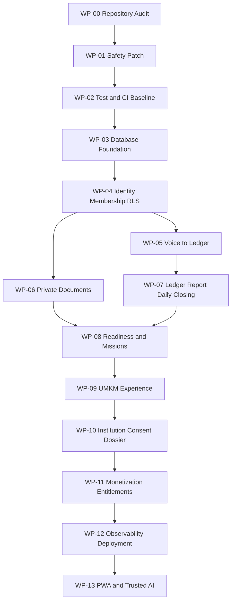

# BERKEMBANG.ID - Codex & Claude Code Execution Playbook

> Master implementation guide untuk coding agent, engineering team, product, QA, data, dan DevOps.  
> Versi: 1.0  
> Tanggal: 25 Agustus 2026  
> Status: Target implementation plan; bukan klaim seluruh fitur sudah tersedia di production.  
> Companion documents: `BERKEMBANG_ID_UPDATE_IMPLEMENTATION_PLAN.md` dan `BERKEMBANG_ID_Target_Database_Schema.sql`.

## 0. Cara menggunakan dokumen ini

Dokumen ini dapat diberikan kepada Codex atau Claude Code sebagai konteks utama sebelum agent mengubah repository BERKEMBANG.ID.

Aturan pemakaian:

1. Jangan meminta agent mengerjakan seluruh dokumen dalam satu sesi atau satu pull request.
2. Kerjakan satu work package pada satu waktu.
3. Mulai dari `WP-00 Repository Audit` dan `WP-01 Safety Patch`.
4. Setiap work package wajib menghasilkan test, catatan perubahan, dan bukti verifikasi.
5. Jangan melanjutkan ke work package berikutnya jika acceptance criteria tahap sekarang belum terpenuhi.
6. Agent harus membaca `AGENTS.md`, `CLAUDE.md`, `package.json`, dan dokumentasi Next.js lokal sebelum mengubah kode.
7. Jika repository aktual berbeda dari snapshot dokumen, kondisi repository aktual menjadi sumber kebenaran dan perbedaan harus dilaporkan.

### Urutan penggunaan yang disarankan

```text
1. Tempel Master Prompt
2. Minta agent menjalankan WP-00
3. Review laporan audit
4. Koreksi asumsi bila diperlukan
5. Jalankan WP-01
6. Review diff dan test
7. Lanjutkan work package secara berurutan
```

---

## 1. Master prompt siap pakai

Gunakan prompt berikut pada awal sesi Codex atau Claude Code:

```text
Anda adalah senior full-stack engineer dan product-minded security engineer untuk BERKEMBANG.ID.

Baca terlebih dahulu:
1. AGENTS.md dan CLAUDE.md di repository.
2. Dokumen BERKEMBANG_ID_CODEX_CLAUDE_EXECUTION_PLAYBOOK.md ini.
3. BERKEMBANG_ID_UPDATE_IMPLEMENTATION_PLAN.md.
4. BERKEMBANG_ID_Target_Database_Schema.sql.
5. package.json, tsconfig, next.config, proxy/middleware, Supabase clients, route AI, score engine, dan route yang relevan dengan work package.

Sebelum mengubah kode:
- periksa git status dan jangan menimpa perubahan pengguna;
- petakan implementasi aktual dan bedakan fitur real, parsial, mock, dan belum ada;
- baca dokumentasi Next.js yang tersedia di node_modules untuk API/convention versi repository;
- jalankan baseline lint, typecheck, test, dan build yang tersedia;
- laporkan asumsi, risiko, dan file yang akan diubah;
- jangan melakukan rewrite total jika perbaikan bertahap masih memungkinkan.

Non-negotiable invariants:
- AI tidak pernah membuat transaksi fiktif;
- transaksi final hanya tersimpan setelah konfirmasi UMKM;
- role berasal dari sumber server-controlled/membership dan diverifikasi dengan RLS;
- dokumen sensitif berada di private storage;
- institusi tidak melihat PII sebelum consent aktif;
- pembayaran tidak pernah menggantikan consent;
- readiness bukan credit score dan tidak menentukan kelayakan kredit;
- data belum cukup menghasilkan unknown/null, bukan angka rekaan;
- analytics production tidak boleh hardcoded;
- operasi privileged tidak dilakukan langsung dari browser;
- semua akses sensitif memiliki audit event.

Kerjakan hanya work package yang saya sebutkan. Jangan memulai paket berikutnya. Setelah selesai, berikan:
1. ringkasan outcome;
2. daftar file yang berubah;
3. keputusan teknis;
4. migration/RLS impact;
5. test yang dijalankan dan hasilnya;
6. risiko atau pekerjaan lanjutan;
7. langkah verifikasi manual.

Work package saat ini: [TULIS ID DAN NAMA WORK PACKAGE]
```

---

## 2. Keputusan produk dan bisnis yang sudah dikunci

| Area | Keputusan MVP |
|---|---|
| Segmen awal | UMKM pangan; model data tetap general untuk sektor lain. |
| Login | WhatsApp/nomor telepon dan email; keduanya mengarah ke satu identity. |
| Jumlah usaha | UI mengaktifkan satu usaha per akun; database tetap mendukung 1:N. |
| Anggota usaha | Owner dapat mengundang staff/kasir. |
| Role MVP | `owner` dan `staff`; role lanjutan tetap dapat disiapkan di database. |
| Pencatatan | Suara, teks, dan manual; foto nota setelah voice stabil. |
| Transaksi final | Hanya setelah review dan konfirmasi UMKM. |
| Tutup hari | Disediakan sebagai ritual opsional, bukan blocker. |
| Edit transaksi | Sebelum tutup hari dapat diedit; setelah tutup hari menggunakan cancel/adjustment dan histori. |
| Readiness | `Kesiapan Data Usaha`, bukan credit score. |
| Misi | Satu misi utama pada satu waktu berdasarkan gap nyata. |
| Program | UMKM dapat melihat program relevan; kecocokan bukan jaminan diterima. |
| Kandidat institusi | Anonim sebelum consent. |
| Consent | Granular per tujuan dan kelompok data; default 14 hari, maksimal 30 hari. |
| Dossier | Disebut `Profil Usaha Terverifikasi` pada UI UMKM. |
| Monetisasi | Institusi membayar platform, verifikasi, dan akses dossier berizin; bukan membeli kepemilikan data. |
| Offline | Dikerjakan setelah core loop stabil; mulai dari draft transaksi. |
| AI Coach | Kontekstual terlebih dahulu; chatbot bebas bukan prioritas MVP. |

### Positioning yang tidak boleh berubah

> BERKEMBANG.ID menyiapkan UMKM untuk dinilai, bukan menilai kelayakan kredit UMKM.

Jangan gunakan istilah berikut di UI atau copy publik:

- credit score BERKEMBANG.ID;
- pasti diterima pembiayaan;
- data UMKM dijual;
- investor membeli data pribadi;
- verified jika belum ada proses verifikasi nyata.

Gunakan:

- Kesiapan Data Usaha;
- kandidat anonim;
- Profil Usaha Terverifikasi;
- akses data berdasarkan persetujuan;
- institution subscription;
- dossier processing/access fee.

---

## 3. Snapshot codebase yang menjadi dasar

Snapshot awal menunjukkan:

- Next.js 16 App Router, React 19, TypeScript, dan Tailwind CSS 4.
- Supabase digunakan untuk Auth, PostgreSQL, dan Storage.
- Portal UMKM paling matang: profil, catat, laporan, dokumen, dan score.
- Mayoritas data diakses langsung dari Client Components.
- Satu API route AI: `POST /api/ai/transcribe`.
- Provider fallback saat ini: Groq, OpenAI, kemudian Gemini.
- Score live dihitung di browser melalui `lib/score.ts`.
- Portal institusi mayoritas mock.
- Portal admin campuran real, parsial, dan mock.
- Migration, schema resmi, generated DB types, RLS tests, CI, dan test suite belum tersedia pada snapshot.

### File existing yang perlu diaudit terlebih dahulu

```text
AGENTS.md
CLAUDE.md
package.json
tsconfig.json
next.config.ts
proxy.ts
lib/supabase.ts
lib/score.ts
app/api/ai/transcribe/route.ts
app/auth/login/page.tsx
app/auth/register/page.tsx
app/(umkm)/layout.tsx
app/(umkm)/umkm/page.tsx
app/(umkm)/umkm/catat/page.tsx
app/(umkm)/umkm/laporan/page.tsx
app/(umkm)/umkm/score/page.tsx
app/(umkm)/umkm/gaps/page.tsx
app/(umkm)/umkm/upload/page.tsx
app/(umkm)/umkm/profil/page.tsx
app/(umkm)/umkm/roadmap/page.tsx
app/(umkm)/umkm/aktivitas/page.tsx
app/(umkm)/umkm/ai-copilot/page.tsx
app/(umkm)/umkm/notifikasi/page.tsx
app/(dashboard)/institusi/page.tsx
app/(dashboard)/institusi/dossiers/page.tsx
app/(dashboard)/institusi/analytics/page.tsx
app/(admin)/admin/rules/page.tsx
app/(admin)/admin/admins/page.tsx
```

Agent tidak boleh berasumsi daftar tersebut masih identik. Verifikasi menggunakan pencarian file aktual.

---

## 4. Cara kerja agent di repository

### 4.1 Preflight wajib

Sebelum mengedit:

```text
1. Baca AGENTS.md dan CLAUDE.md sampai selesai.
2. Periksa git status dan branch.
3. Daftar source files dan routes.
4. Baca package.json dan lockfile.
5. Periksa versi Node, Next.js, React, TypeScript, dan Supabase.
6. Jika node_modules tersedia, baca dokumentasi Next.js lokal yang relevan.
7. Temukan seluruh Supabase client dan penggunaan service role.
8. Temukan seluruh sumber role/permission.
9. Temukan seluruh nominal fallback, hardcoded analytics, dan public storage URL.
10. Jalankan baseline lint/build/test yang tersedia.
```

### 4.2 Stop conditions

Agent harus berhenti dan meminta keputusan jika:

- worktree memiliki perubahan pengguna yang overlap dengan file target;
- Supabase production schema berbeda dan migrasi berpotensi menghapus data;
- migration membutuhkan destructive operation tanpa backup/backfill plan;
- service-role key atau credential sensitif terlihat dalam client bundle;
- tidak ada akses ke schema/policy yang diperlukan untuk membuktikan keamanan;
- perubahan dapat mengubah klasifikasi regulasi produk menjadi PKA/PAJK;
- target pembayaran/provider belum dipilih tetapi implementasi membutuhkan transaksi nyata;
- requirement bisnis bertentangan dengan consent atau hak pengguna.

### 4.3 Aturan perubahan

- Buat perubahan sekecil mungkin tetapi lengkap secara vertikal.
- Jangan menambah dependency jika platform/library existing cukup.
- Jika menambah dependency, jelaskan alasan, lisensi, ukuran, dan dampaknya.
- Gunakan TypeScript strict; jangan menambah `any` tanpa alasan.
- Jangan menyimpan secret dalam `NEXT_PUBLIC_*`.
- Jangan menjalankan destructive git/database command.
- Jangan deploy production tanpa instruksi eksplisit.
- Jangan mengubah data production saat mengembangkan migration.
- Jangan menyamarkan data mock sebagai real.

---

## 5. Dependency graph work package



Jangan menjalankan work package secara paralel jika menyentuh migration atau domain file yang sama.

---

## 6. Target stack dan boundary

### Dipertahankan

- Next.js App Router.
- React dan TypeScript strict.
- Tailwind CSS.
- Supabase Auth, PostgreSQL, dan Storage.
- Provider AI melalui adapter internal.

### Ditambahkan jika belum ada

- Zod untuk request/response dan AI structured output.
- Generated Supabase database types.
- Vitest untuk unit test.
- Testing Library untuk component test.
- Playwright untuk E2E.
- Structured logging dan error tracking.
- Database-backed job queue untuk pilot.
- Rate limiter dan quota server-side.

### Boundary

| Operasi | Boundary |
|---|---|
| UI interaktif | Client Component seperlunya |
| Initial/sensitive reads | Server Component atau BFF |
| Role dan permission | Server + membership + RLS |
| AI job creation | Authenticated server route/action |
| AI processing | Background worker |
| Transaction confirmation | Server transaction/RPC |
| Readiness calculation | Server-side worker/service |
| Signed document URL | Server-only setelah scope check |
| Admin provisioning | Server-only |
| Audit append | Server/database function |

---

## 7. Target folder structure

Adaptasikan secara bertahap; jangan memindahkan seluruh codebase sekaligus.

```text
app/
  api/v1/
    captures/
    transactions/
    documents/
    readiness/
    missions/
    dossier-requests/
    consent-grants/
    dossiers/
    admin/

modules/
  identity/
  businesses/
  ledger/
  documents/
  readiness/
  missions/
  institutions/
  consent/
  dossiers/
  ai/
  notifications/
  audit/
  billing/

lib/
  auth/
  db/
  env/
  observability/
  rate-limit/
  storage/
  validation/

supabase/
  migrations/
  tests/
  seed.sql

workers/
  ai/
  readiness/

tests/
  unit/
  integration/
  e2e/
```

Domain baru idealnya memiliki:

```text
schema.ts
types.ts
repository.ts
service.ts
permissions.ts
events.ts
*.test.ts
```

---

# WORK PACKAGES

## WP-00 - Repository Audit

### Tujuan

Membuktikan kondisi aktual sebelum melakukan perubahan.

### Tugas

1. Inventaris route, API, component, library, migration, dan test.
2. Petakan setiap fitur sebagai `working`, `partial`, `mock`, atau `missing`.
3. Cari semua query Supabase dan storage access.
4. Cari semua sumber role:
   - `user_metadata`;
   - `app_metadata`;
   - `profiles.role`;
   - email prefix;
   - route/client checks.
5. Cari semua fabricated transaction/fallback nominal.
6. Cari semua `getPublicUrl`, public bucket, dan dokumen sensitif.
7. Cari analytics/aktivitas/notifikasi hardcoded.
8. Cari operasi admin yang menggunakan browser auth atau service role secara salah.
9. Jalankan baseline quality commands.
10. Buat laporan `docs/audits/current-state.md`.

### Output

- Tidak ada source code yang diubah selain dokumen audit.
- Daftar blocker dan perbedaan terhadap playbook.
- Urutan perubahan P0 yang disesuaikan dengan repository aktual.

### Acceptance criteria

- Semua risiko kritis memiliki evidence file dan lokasi.
- Tidak ada klaim fitur berjalan tanpa query/API/event nyata.
- Baseline lint/build/test dicatat lengkap, termasuk kegagalan existing.

### Prompt work package

```text
Jalankan WP-00 Repository Audit. Ini read-only terhadap application code. Buat docs/audits/current-state.md yang memetakan working/partial/mock/missing, security boundaries, Supabase queries, role sources, AI fallback, storage access, test/build status, dan perbedaan terhadap execution playbook. Jangan memperbaiki kode pada work package ini.
```

---

## WP-01 - Safety Patch

### Tujuan

Menghentikan risiko paling berbahaya sebelum fitur baru.

### Scope

- Hapus seluruh fabricated financial data.
- Pastikan save failure tidak tampil sebagai success.
- Lindungi AI route minimum.
- Hapus secret publik.
- Tandai/sembunyikan mock production UI.
- Perbaiki route yang tidak ada dan encoding rusak.

### File kandidat

```text
app/api/ai/transcribe/route.ts
app/(umkm)/umkm/catat/page.tsx
app/(umkm)/umkm/ai-copilot/page.tsx
app/(umkm)/umkm/aktivitas/page.tsx
app/(umkm)/umkm/notifikasi/page.tsx
app/(dashboard)/institusi/**/*.tsx
app/(admin)/admin/analytics/page.tsx
proxy.ts
.env.example
```

### Required behavior

Jika provider AI gagal:

```json
{
  "status": "failed",
  "error": {
    "code": "AI_PROCESSING_FAILED",
    "message": "Rekaman belum dapat diproses. Silakan coba lagi atau gunakan input manual."
  },
  "transactions": []
}
```

Tidak boleh ada nominal default.

### Acceptance criteria

- Pencarian repository tidak menemukan fallback nominal/transaksi contoh pada production path.
- Request AI tanpa session ditolak.
- MIME dan ukuran audio diperiksa.
- Response AI divalidasi schema.
- Database error menghasilkan error UI yang jujur.
- Fitur mock diberi label demo atau dinonaktifkan dengan feature flag.
- Tidak ada secret AI dalam variable `NEXT_PUBLIC_*`.

### Test minimum

- Semua provider gagal menghasilkan `transactions: []`.
- Request tanpa auth menghasilkan 401.
- File bukan audio menghasilkan 415/400.
- File terlalu besar menghasilkan 413/400.
- Insert database gagal tidak menampilkan success toast.

### Prompt work package

```text
Implementasikan WP-01 Safety Patch berdasarkan hasil WP-00. Prioritas mutlak: zero fabricated financial data, honest save state, authenticated AI route, MIME/size validation, no public secret, dan penandaan fitur mock. Jangan mengubah schema besar pada paket ini. Tambahkan test untuk semua failure path.
```

---

## WP-02 - Test and CI Baseline

### Tujuan

Membuat safety net sebelum refactor domain dan database.

### Tambahkan script

```json
{
  "scripts": {
    "typecheck": "tsc --noEmit",
    "test": "vitest run",
    "test:watch": "vitest",
    "test:integration": "vitest run --config vitest.integration.config.ts",
    "test:e2e": "playwright test",
    "test:e2e:smoke": "playwright test --grep @smoke"
  }
}
```

Sesuaikan command dengan package manager repository; jangan mengganti lockfile ecosystem.

### Test awal

- Normalisasi nominal Indonesia.
- Parser transaksi.
- AI response schema.
- Role resolution existing sebagai characterization test.
- Score existing sebagai characterization test sebelum diganti.
- Success/error state transaksi.

### CI stages

```text
install frozen dependencies
lint
typecheck
unit test
build
```

Integration, migration, RLS, dan E2E ditambahkan setelah environment tersedia.

### Acceptance criteria

- Command lokal dan CI konsisten.
- Test failure menyebabkan CI gagal.
- Existing behavior yang buruk boleh ditandai sebagai expected debt, bukan disembunyikan.
- Tidak ada test yang mengakses production Supabase.

---

## WP-03 - Database Foundation

### Tujuan

Menjadikan schema, migration, constraints, indexes, dan generated types sebagai bagian repository.

### Migration order

```text
0001_identity_business_membership.sql
0002_programs_enrollments.sql
0003_ledger_captures.sql
0004_private_documents.sql
0005_readiness_missions.sql
0006_consent_dossiers.sql
0007_ai_notifications_audit.sql
0008_indexes_constraints.sql
0009_rls_policies.sql
0010_storage_policies.sql
0011_backfill_existing_data.sql
0012_compatibility_views.sql
```

### Core tables

Identity/business:

```text
profiles
businesses
business_members
institutions
institution_members
programs
program_enrollments
```

Ledger/documents:

```text
transaction_captures
transactions
daily_closings
documents
document_versions
document_extractions
document_verifications
```

Readiness/AI:

```text
readiness_rule_sets
readiness_score_snapshots
readiness_score_components
missions
business_missions
ai_jobs
ai_runs
ai_feedback
```

Consent/operations:

```text
dossier_requests
consent_grants
dossiers
dossier_items
dossier_access_events
notifications
audit_events
```

### Data rules

- Primary key UUID.
- `created_at` dan `updated_at` menggunakan `timestamptz`.
- Waktu disimpan UTC; UI menampilkan Asia/Jakarta.
- Nominal rupiah menggunakan `bigint` dan `amount_idr >= 0`.
- Tanggal transaksi menggunakan `date`.
- Status memiliki check constraint.
- Idempotency key memiliki unique constraint dalam scope business/user yang tepat.
- Dokumen menyimpan private `storage_path`, MIME, size, checksum, dan version.
- Snapshot readiness immutable.
- Audit/access event append-only.

### Backfill rules

1. Jangan menghapus kolom/tabel lama pada release pertama.
2. Buat satu business untuk setiap profil UMKM lama.
3. Buat owner membership.
4. Backfill transaksi dari `user_id` ke `business_id`.
5. Backfill dokumen menjadi document + version.
6. Backfill readiness snapshot pertama.
7. Jalankan consistency query dan simpan hasilnya.
8. Gunakan compatibility view/dual-read hanya selama transisi.

### Acceptance criteria

- Fresh database dapat dibuat dari migration saja.
- Migration dapat diterapkan dua kali tanpa menghasilkan duplikasi yang tidak diinginkan.
- Backfill memiliki count comparison dan orphan check.
- Generated TypeScript types ter-update.
- Tidak ada destructive migration tanpa tahap deprecation terpisah.

### Verification queries

```text
orphan profiles/businesses
orphan transactions
duplicate idempotency keys
documents without versions
active grants without approved requests
snapshot without rule set
invalid negative amount
```

---

## WP-04 - Identity, Membership, and RLS

### Tujuan

Mengganti role berbasis metadata/email dengan membership yang server-controlled.

### Role MVP

Business:

```text
owner
staff
```

Database boleh menyiapkan:

```text
manager
viewer
```

Institution:

```text
admin
analyst
reviewer
viewer
```

### Permission MVP

| Action | Owner | Staff |
|---|---:|---:|
| Mencatat transaksi | Ya | Ya |
| Mengedit draft sendiri | Ya | Ya |
| Melihat seluruh laporan | Ya | Sesuai keputusan produk; default terbatas |
| Mengelola dokumen legal | Ya | Tidak |
| Mengundang anggota | Ya | Tidak |
| Approve/reject/revoke consent | Ya | Tidak |
| Menghapus/menonaktifkan usaha | Ya | Tidak |

### RLS tests minimum

- User A tidak dapat membaca business User B.
- Staff tidak dapat menaikkan role sendiri.
- Staff tidak dapat mengelola consent.
- Institution A tidak dapat membaca request Institution B.
- Institusi tidak dapat membaca transaksi mentah tanpa grant/scope.
- User biasa tidak dapat menulis rule set, AI run, dan privileged audit.
- Admin UI route tidak dapat menggantikan policy database.

### Server-only operations

- Admin provisioning.
- Institution provisioning.
- Membership role escalation.
- Rule publish.
- Signed document URL.
- Dossier generation.
- Worker writes.

### Acceptance criteria

- `user_metadata.role` dan email prefix bukan authority.
- Semua table dengan data user memiliki RLS enabled.
- Cross-account tests lulus.
- Service role tidak pernah masuk client bundle.
- Redirect UI membaca role efektif dari server-controlled source.

---

## WP-05 - Voice-to-Ledger

### Tujuan

Membuat capture asynchronous, idempotent, dapat diaudit, dan human-confirmed.

### State machine

```text
draft
-> queued
-> processing
-> needs_review
-> confirmed

Failure states:
failed
cancelled
```

### Endpoint minimum

| Method | Endpoint | Fungsi |
|---|---|---|
| POST | `/api/v1/captures` | Membuat capture dan upload instruction/session. |
| POST | `/api/v1/captures/:id/process` | Menjadwalkan job idempotent. |
| GET | `/api/v1/captures/:id` | Mengambil status dan draft. |
| POST | `/api/v1/captures/:id/confirm` | Menyimpan transaksi secara atomik. |
| POST | `/api/v1/captures/:id/cancel` | Membatalkan capture belum final. |

### Transaction draft schema

```ts
type TransactionDraftItem = {
  clientItemId: string
  transactionType: 'income' | 'expense'
  amountIdr: number
  transactionDate: string
  categoryCode: string
  description: string
  quantity?: number | null
  unit?: string | null
  unitPriceIdr?: number | null
  paymentMethod?: 'cash' | 'qris' | 'bank_transfer' | 'ewallet' | 'credit' | 'other' | null
  salesChannel?: string | null
  confidence?: number | null
}
```

Server tidak boleh percaya field `confidence`, category, date, atau nominal dari browser tanpa validasi.

### AI pipeline

```text
private upload
-> ai_job
-> transcription provider
-> extraction provider
-> Zod schema validation
-> normalization
-> draft persistence
-> user review
-> atomic confirmation
```

### Provider adapter

```ts
interface TranscriptionProvider {
  transcribe(input: AudioInput): Promise<TranscriptResult>
}

interface ExtractionProvider {
  extractTransactions(input: TranscriptInput): Promise<TransactionDraftItem[]>
}
```

### Retry policy

- Retry hanya untuk timeout/rate-limit/transient provider error.
- Validation error tidak di-retry tanpa perubahan prompt/provider.
- Batasi attempts.
- Simpan satu `ai_run` per attempt.
- Circuit-break provider yang gagal berulang.
- Jika semua provider gagal, tawarkan input manual.

### AI telemetry

- Job type.
- Provider/model.
- Start/end/latency.
- Status dan error code.
- Retry reason.
- Token/cost jika tersedia.
- Draft correction rate melalui feedback.

Jangan log audio/transcript mentah dalam audit/error monitoring.

### Confirmation transaction

Dalam satu database transaction/RPC:

1. Lock/check capture.
2. Pastikan status `needs_review`.
3. Pastikan idempotency belum dikonfirmasi.
4. Validasi semua item.
5. Insert transactions.
6. Update capture `confirmed`.
7. Append audit event.
8. Enqueue readiness recalculation.

### Acceptance criteria

- Request web tidak menunggu seluruh AI processing.
- Refresh halaman tidak kehilangan capture.
- Retry tidak menggandakan transaksi.
- AI failure tidak membuat nominal.
- Draft tidak masuk laporan/readiness.
- User selalu melihat dan mengonfirmasi draft.

---

## WP-06 - Private Documents

### Tujuan

Memindahkan dokumen sensitif dari public URL ke private lifecycle.

### Upload flow

```text
select file
-> client precheck
-> authenticated upload
-> private storage
-> document_version
-> extraction job
-> structured data
-> verification
```

### Validasi

- Allowlist MIME dan extension.
- Batas ukuran per document type.
- Checksum.
- Sanitasi filename.
- Private storage path tidak dapat dipilih sembarang oleh browser.
- Optional malware scan jika infrastruktur tersedia.

### Status

```text
uploaded
processing
verified
rejected
superseded
```

### Food-sector document template

Core:

```text
KTP
NIB
NPWP
```

Conditional:

```text
PIRT
sertifikat halal
izin edar
rekening koran
riwayat QRIS
foto tempat usaha
laporan keuangan
utilitas
```

### Access rules

- Owner dapat melihat business document sendiri.
- Staff tidak melihat legal documents secara default.
- Institusi hanya melihat dossier item yang diizinkan grant aktif.
- Signed URL berumur pendek.
- Setiap view/download institusi menghasilkan access event.

### Migration public-to-private

1. Inventaris object dan row lama.
2. Copy ke private path.
3. Verifikasi checksum dan row mapping.
4. Uji signed URL authorization.
5. Hentikan penulisan public URL baru.
6. Cabut/hapus public exposure setelah verifikasi.
7. Jangan menghapus sumber sebelum backup dan audit selesai.

### Acceptance criteria

- Tidak ada dokumen sensitif dengan public URL permanen.
- Versioning bekerja.
- File invalid ditolak.
- User mendapat reason yang dapat ditindaklanjuti jika rejected.
- Access event tercatat.

---

## WP-07 - Ledger, Report, and Daily Closing

### Tujuan

Membuat buku kas sederhana tetapi memiliki integritas dan provenance.

### Required transaction fields

```text
transaction_type
amount_idr
transaction_date
category_code
description
```

Optional:

```text
quantity
unit
unit_price_idr
payment_method
sales_channel
counterparty
evidence_document_version_id
```

### Category design

Gunakan dua lapis:

```text
category_group: sales | cost_of_goods | operating_expense | asset | other
category_code: configurable per sector
```

Food defaults:

```text
sales_direct
sales_delivery
sales_catering
raw_material
packaging
utilities
wage
rent
platform_fee
transport
equipment
promotion
other
```

### Edit policy

- Sebelum daily closing: owner/staff berizin dapat edit.
- Setelah closing: gunakan cancel/adjustment dengan reason.
- Jangan hard-delete transaksi final tanpa privileged recovery process.
- Semua perubahan mencatat actor, previous value summary, reason, dan timestamp tanpa menaruh data sensitif berlebihan.

### Daily closing

Input:

```text
opening_cash optional
system_cash_in
system_cash_out
expected_cash
physical_cash optional
difference optional
note optional
status
```

UX maksimal sekitar satu menit dan tidak menjadi blocker.

### Reports

- Today/7 days/month/custom.
- Income, expense, net difference.
- Category distribution.
- Payment method distribution.
- Activity days.
- Export CSV aman dari formula injection.
- Timezone boundary Asia/Jakarta.

### Acceptance criteria

- Report hanya membaca confirmed/non-cancelled transaction.
- Total integer rupiah akurat.
- Date filter tidak bergeser karena UTC.
- Edit/cancel history tersedia.
- Daily closing tidak memalsukan saldo jika input belum lengkap.

---

## WP-08 - Readiness and Missions

### Tujuan

Mengganti tiga sumber score menjadi satu engine versioned dan explainable.

### Source of truth

```text
readiness_rule_sets
-> readiness_score_snapshots
-> readiness_score_components
```

`lib/score.ts`, `profiles.readiness_score`, dan rules admin lama tidak boleh menjadi tiga authority terpisah.

### Initial framework

Core maximum 70:

- Transaction recording consistency/duration: 45.
- Basic legality: 25.

Strengthening maximum 30:

- Utilities.
- Digital footprint.
- E-commerce/digital payments.
- Complete profile.
- Certificates/training.

Bobot adalah konfigurasi BERKEMBANG.ID dan harus terversi; bukan bobot resmi regulator.

### Component result

```ts
type ReadinessComponentResult = {
  code: string
  status: 'scored' | 'data_insufficient' | 'not_applicable'
  score: number | null
  maxScore: number
  confidence: number
  freshness: 'fresh' | 'aging' | 'stale'
  evidenceCount: number
  explanation: string
  nextAction: string | null
}
```

### Quality tiers

```text
verified: QRIS/bank/document verification
confirmed: user-confirmed plus reconciliation/evidence
recorded: manual record only
```

Jangan mengklaim transaksi tunai 100% benar. Tampilkan provenance/quality tier secara jujur.

### Score events

Recalculate ketika:

- profile updated;
- transaction confirmed/cancelled;
- daily closing completed;
- document verified/rejected/superseded;
- mission completed;
- rule set effective date berubah.

### Mission engine

Pilih satu misi berdasarkan:

1. Dampak gap.
2. Effort rendah.
3. Dependency terpenuhi.
4. Evidence yang dibutuhkan.
5. Riwayat dismiss/failure.

Misi selesai berdasarkan evidence, bukan tombol klaim semata.

### Rule lifecycle

```text
draft
-> simulate
-> approve/publish
-> active at effective_date
-> retired
```

Snapshot lama tidak diubah ketika rule baru aktif.

### Acceptance criteria

- UI dan admin membaca source of truth yang sama.
- Setiap snapshot menunjuk rule version.
- Data belum cukup menghasilkan null/unknown.
- Setiap score memiliki explanation dan evidence count.
- Mission completion memicu snapshot baru.

---

## WP-09 - UMKM Experience

### Tujuan

Menyederhanakan navigasi dan state tanpa mengurangi kekuatan fitur.

### Final navigation

```text
Beranda
Catat
Laporan
Perjalanan
Dokumen
Profil
```

Notifikasi berada di header. Consent berada pada notifikasi dan `Profil > Privasi dan Akses Data`.

### Home order

1. CTA `Catat pemasukan atau pengeluaran`.
2. Ringkasan hari ini.
3. Satu misi utama.
4. Kesiapan Data Usaha dan alasan perubahan.
5. Action-required: draft, document, consent, sync.
6. Aktivitas terbaru dari event nyata.

### Onboarding

Step 1 account:

```text
owner name
WhatsApp or email
verification
terms/privacy acceptance
```

Step 2 business:

```text
business name
sector/subsector
city/regency
```

Step 3 first transaction.

NIB/NPWP/revenue/employee count tidak wajib pada onboarding.

### Voice UX states

```text
ready
recording
uploading
processing
needs_review
saving
success
failed
```

Setiap state wajib memiliki copy, icon/status, dan next action.

### Terminology

| Technical | UMKM UI |
|---|---|
| Readiness score | Kesiapan Data Usaha |
| Journey/gaps/roadmap | Perjalanan |
| Mission | Misi |
| Dossier | Profil Usaha Terverifikasi |
| Consent | Persetujuan Akses Data |
| Access log | Riwayat Akses |
| Data insufficient | Data belum cukup |

### Accessibility

- Keyboard navigation.
- Focus trap dan Escape pada modal.
- Dialog semantics.
- Label input.
- Contrast.
- Reduced motion.
- Loading/error diumumkan kepada assistive technology.
- Touch target mobile yang cukup.

### Acceptance criteria

- Tidak ada link menuju route yang hilang.
- Tidak ada data mock pada production path.
- Satu primary action per screen.
- Error state tidak menghapus draft.
- Mobile flow dapat diselesaikan dengan satu tangan.

---

## WP-10 - Institution, Consent, and Dossier

### Tujuan

Membangun flow anonim -> request -> consent -> scoped dossier -> audit -> revoke/expire.

### Institution verification

Institution account tidak langsung aktif. Status:

```text
pending
active
inactive
suspended
```

Admin/server memverifikasi organisasi dan member role.

### Anonymous candidate fields

Boleh:

```text
candidate code
sector/subsector
general city/regency
business age range
readiness band
recording duration/activity band
evidence availability
program match
```

Tidak boleh:

```text
owner name
phone/email
NIK/NPWP
exact address
raw document
raw transaction
identifying business name where unsafe
```

### Request schema

```ts
type DossierRequestInput = {
  businessId: string
  programId?: string | null
  purposeCode: string
  purposeDescription: string
  requestedScope: Array<
    | 'business_identity'
    | 'readiness'
    | 'financial_summary'
    | 'nib'
    | 'npwp'
    | 'owner_identity'
    | 'qris_history'
    | 'sector_certificates'
  >
  requestedDurationDays: number
  downloadRequested: boolean
}
```

Default duration 14 hari; server menolak nilai di atas 30 hari untuk MVP.

### Consent UI

UMKM melihat:

- siapa yang meminta;
- program;
- purpose;
- scope item per item;
- required/optional item;
- download permission;
- start/end date;
- tombol reject/approve.

Payment/subscription institution tidak memengaruhi hak reject.

### Dossier generation

- Dossier adalah frozen snapshot.
- Isi hanya scope yang disetujui.
- Financial data default adalah aggregate/range, bukan raw transaction.
- Raw KTP/NIK tidak dibagikan kecuali benar-benar diperlukan dan disetujui.
- Dossier memiliki expiry.

### Access check pada setiap request

```text
authenticated institution member?
institution active?
grant active?
within expiry?
requested resource in scope?
download allowed?
dossier active?
```

Jika valid, log `view/download/verify`. Jika tidak, log `access_denied` tanpa membocorkan data.

### Revocation

- Hanya owner business dapat revoke.
- Revoke efektif segera pada authorization layer.
- Signed URL pendek membatasi residual exposure.
- Riwayat akses sebelumnya tetap append-only.

### Acceptance criteria

- Institusi tidak melihat PII sebelum consent.
- Approved request menghasilkan maksimal satu active grant sesuai rule.
- Reject tidak menghasilkan dossier/grant.
- Scope dan expiry diperiksa pada setiap akses.
- Revoke/expiry menghentikan akses.
- Semua akses menghasilkan access event.

---

## WP-11 - Monetization and Entitlements

### Tujuan

Menerapkan model bisnis tanpa menjual kepemilikan data atau melewati consent.

### Revenue model

```text
institution subscription
program/cohort fee
per-consented-dossier processing/access fee
enterprise/API fee
aggregate insight fee
```

### Prinsip billing

- Payment membeli layanan dan entitlement, bukan ownership data.
- Subscription memungkinkan anonymous discovery dan program tools.
- Dossier credit dapat di-reserve saat request.
- Credit dikonsumsi ketika consent disetujui dan dossier siap.
- Credit dilepas jika request rejected/cancelled/expired.
- UMKM tidak dikenakan biaya untuk menerima atau menolak request.
- Payment failure tidak boleh membocorkan data.

### Suggested future entities

```text
institution_plans
institution_subscriptions
institution_entitlements
dossier_credit_ledger
billing_events
```

Entitas billing dikerjakan hanya setelah flow consent stabil dan provider pembayaran dipilih.

### Hackathon mode

Gunakan `billing_mode=sandbox`:

- seed demo plan dan demo credit;
- label UI `Simulasi/Sandbox`;
- tidak mengklaim pembayaran nyata;
- consent dan authorization tetap nyata;
- jangan membuat saldo/transaction billing fiktif pada environment production.

### Acceptance criteria

- Institusi tanpa entitlement tidak dapat memakai fitur berbayar.
- Institusi berbayar tetap tidak dapat melewati consent.
- Charge/reservation idempotent.
- Refund/release tercatat.
- Audit dapat membedakan request, consent, dossier, access, dan charge.

---

## WP-12 - Observability, Security, and Deployment

### Technical telemetry

- API latency/error rate.
- Database latency/error.
- AI queue time, processing time, retries, fallback, cost.
- Draft correction rate.
- Upload failure.
- Readiness recalculation delay.
- Consent/access denied/revocation events.
- Worker dead-letter count.

### Privacy logging rules

Jangan log:

```text
password/token/secret
NIK penuh
raw KTP/NPWP
audio bytes
raw transcript
document contents
full financial payload
signed URL
```

Gunakan internal ID, status, duration, provider, error code, dan safe metadata.

### Environment

```text
local
preview/development
staging
production
```

Setiap environment memiliki database, storage, auth config, AI quota, dan secret terpisah.

### Environment variables

Public:

```text
NEXT_PUBLIC_APP_URL
NEXT_PUBLIC_SUPABASE_URL
NEXT_PUBLIC_SUPABASE_ANON_KEY
```

Server-only examples:

```text
SUPABASE_SERVICE_ROLE_KEY
GROQ_API_KEY
OPENAI_API_KEY
GEMINI_API_KEY
AI_PRIMARY_PROVIDER
AI_MAX_AUDIO_BYTES
AI_MAX_AUDIO_DURATION_SECONDS
AI_DAILY_QUOTA_PER_BUSINESS
DOSSIER_DEFAULT_TTL_DAYS=14
DOSSIER_MAX_TTL_DAYS=30
BILLING_MODE=disabled|sandbox|live
LOG_LEVEL
ERROR_TRACKING_DSN
```

Nama final menyesuaikan environment parser repository. Validasi env saat startup dan fail fast pada server; jangan membuat browser client dengan empty URL/key.

### Deployment pipeline

```text
pull request
-> lint
-> typecheck
-> unit test
-> migration dry-run
-> RLS integration test
-> build
-> preview deployment
-> smoke E2E
-> approval
-> staging migration/deploy
-> staging E2E
-> production migration/deploy
-> post-deploy smoke
```

### Rollback

- Migration additive terlebih dahulu.
- Backfill terpisah dari destructive cleanup.
- App dapat membaca schema transisi.
- Feature flags untuk institution, dossier, AI Coach, offline, dan billing.
- Provider AI dapat dinonaktifkan tanpa mematikan manual input.
- Rule set dapat di-retire untuk calculation berikutnya; snapshot lama tetap immutable.

### Acceptance criteria

- Preview/staging tidak memakai production data/secret.
- Migration diuji pada database baru dan snapshot sanitasi.
- Alert tersedia untuk AI failure, auth anomaly, dan dossier access error.
- Runbook incident dan rollback terdokumentasi.

---

## WP-13 - PWA and Trusted AI

### PWA scope

- Valid app icons dan installability.
- Safe app shell cache.
- Local transaction drafts.
- Pending mutation queue.
- Idempotent synchronization.
- Clear offline/sync/conflict status.

Jangan cache dokumen sensitif offline pada tahap awal.

### AI Coach scope

- Menggunakan data business yang terotorisasi.
- Menggunakan aggregate, bukan membuka raw document secara default.
- Contextual prompts: report, readiness, mission, document guidance.
- Recommendation memiliki provenance dan periode data.
- Jika data tidak cukup, AI mengatakan data belum cukup.
- Tidak menjanjikan pembiayaan atau memberikan credit decision.

### Photo-to-ledger

Dikerjakan setelah benchmark voice memenuhi target. Hasil OCR menjadi draft dan tetap melalui confirmation.

---

## 8. Complete API checklist

### Auth/business

```text
GET    /api/v1/me
GET    /api/v1/business
PATCH  /api/v1/business
GET    /api/v1/business/members
POST   /api/v1/business/members/invite
PATCH  /api/v1/business/members/:id
DELETE /api/v1/business/members/:id
```

UI tetap hanya mengaktifkan satu business pada MVP.

### Ledger/capture

```text
POST   /api/v1/captures
POST   /api/v1/captures/:id/process
GET    /api/v1/captures/:id
POST   /api/v1/captures/:id/confirm
POST   /api/v1/captures/:id/cancel
GET    /api/v1/transactions
POST   /api/v1/transactions/manual
PATCH  /api/v1/transactions/:id
POST   /api/v1/transactions/:id/cancel
POST   /api/v1/daily-closings
GET    /api/v1/reports/summary
```

### Documents

```text
POST   /api/v1/documents/upload-session
POST   /api/v1/documents/:id/versions
GET    /api/v1/documents
GET    /api/v1/documents/:id
POST   /api/v1/documents/:id/signed-url
POST   /api/v1/documents/:id/archive
```

### Readiness/missions

```text
GET    /api/v1/readiness/latest
GET    /api/v1/readiness/history
GET    /api/v1/missions
POST   /api/v1/missions/:id/start
POST   /api/v1/missions/:id/dismiss
```

Mission completion sebaiknya worker/evidence-driven, bukan endpoint manual biasa.

### Consent/dossier

```text
GET    /api/v1/dossier-requests
GET    /api/v1/dossier-requests/:id
POST   /api/v1/dossier-requests/:id/approve
POST   /api/v1/dossier-requests/:id/reject
GET    /api/v1/consent-grants
POST   /api/v1/consent-grants/:id/revoke
GET    /api/v1/dossiers/:id
POST   /api/v1/dossiers/:id/access
GET    /api/v1/dossiers/:id/access-history
```

### Institution

```text
GET    /api/v1/institution/programs
POST   /api/v1/institution/programs
GET    /api/v1/institution/candidates
POST   /api/v1/institution/dossier-requests
GET    /api/v1/institution/dossiers
GET    /api/v1/institution/analytics
```

Setiap endpoint harus memiliki:

- auth;
- input schema;
- permission check;
- RLS defense-in-depth;
- idempotency untuk mutation yang relevan;
- structured error;
- audit event untuk operasi sensitif;
- test unauthorized/forbidden/not-found/success.

---

## 9. Error contract

Gunakan error contract konsisten:

```ts
type ApiError = {
  error: {
    code: string
    message: string
    fieldErrors?: Record<string, string[]>
    retryable: boolean
    requestId: string
  }
}
```

Error codes minimum:

```text
UNAUTHENTICATED
FORBIDDEN
VALIDATION_FAILED
BUSINESS_ACCESS_DENIED
CAPTURE_ALREADY_CONFIRMED
CAPTURE_PROCESSING_FAILED
AI_QUOTA_EXCEEDED
UNSUPPORTED_MEDIA_TYPE
FILE_TOO_LARGE
DOCUMENT_ACCESS_DENIED
INSUFFICIENT_DATA
CONSENT_REQUIRED
CONSENT_EXPIRED
CONSENT_REVOKED
DOSSIER_SCOPE_DENIED
RATE_LIMITED
INTERNAL_ERROR
```

UI message harus sederhana; internal error detail hanya di server log.

---

## 10. Full test matrix

### Auth/membership

- Email login.
- Phone/WhatsApp identity flow sesuai provider final.
- Satu identity tidak membuat duplicate profile.
- Owner dapat invite staff.
- Staff tidak dapat promote diri.
- Account disabled kehilangan akses.

### Capture/AI

- Audio valid.
- MIME invalid.
- Size/duration limit.
- Unauthorized.
- Quota exceeded.
- Provider primary success.
- Provider retryable failure dan fallback.
- All provider failure.
- Malformed AI JSON.
- Nominal Indonesia: ribu/juta dan singkatan.
- Multi-item transaction.
- User correction.
- Double confirm/retry.

### Ledger/report

- Manual income/expense.
- Negative amount rejected.
- Date Asia/Jakarta.
- Edit before closing.
- Cancel/adjust after closing.
- Report excludes draft/cancelled.
- CSV formula injection.

### Documents

- Private upload.
- Invalid extension/MIME/size.
- Version replacement.
- Owner access.
- Staff denied.
- Cross-business denied.
- Institution without grant denied.
- Signed URL expires.

### Readiness/missions

- Insufficient evidence.
- Rule version/effective date.
- Snapshot immutable.
- Recalculate on evidence event.
- Mission generated from gap.
- Mission completion from evidence.
- New rules do not change history.

### Consent/dossier

- Anonymous candidate hides PII.
- Request valid/invalid scope.
- Reject path.
- Approve path.
- Dossier frozen scope.
- View/download audit.
- Scope denied.
- Expiry.
- Revocation.
- Institution isolation.

### Billing/entitlement

- Subscription active/inactive.
- Credit reserve.
- Reject releases credit.
- Approval consumes credit once.
- Retry idempotent.
- Payment never bypasses consent.

### E2E critical paths

```text
register -> business -> first transaction -> confirmation -> report
transaction/document -> readiness -> mission -> new snapshot
institution anonymous discovery -> request -> reject
institution request -> approve -> dossier -> access log -> revoke -> denied
AI failure -> manual entry -> successful transaction with no fabricated value
```

---

## 11. Feature flags

Feature flags yang direkomendasikan:

```text
ENABLE_INSTITUTION_PORTAL
ENABLE_DOSSIER
ENABLE_BILLING_SANDBOX
ENABLE_AI_COACH
ENABLE_PHOTO_TO_LEDGER
ENABLE_OFFLINE_QUEUE
ENABLE_MULTI_BUSINESS
```

Flags harus dievaluasi server-side untuk keamanan; client flag hanya untuk tampilan.

---

## 12. Pull request strategy

### Ukuran PR

Satu PR idealnya menyelesaikan satu vertical slice atau satu migration concern.

Contoh baik:

```text
PR 1: remove fabricated transaction + tests
PR 2: authenticated AI route + validation + quota
PR 3: database baseline + generated types
PR 4: business membership + RLS tests
PR 5: transaction capture state machine
```

Contoh buruk:

```text
rewrite seluruh portal + schema + AI + deployment dalam satu PR
```

### Commit guideline

```text
fix(ai): remove fabricated transaction fallback
test(ai): cover provider failure paths
feat(db): add business membership foundation
feat(ledger): add idempotent capture confirmation
feat(consent): add scoped dossier grants
```

### PR description template

```markdown
## Outcome

## Scope

## Out of scope

## Files changed

## Database/migration impact

## Security/privacy impact

## Test evidence

## Manual verification

## Rollout/feature flag

## Risks and follow-up
```

---

## 13. Handoff format wajib dari coding agent

Setelah setiap work package, agent memberikan:

```markdown
## Outcome
- Apa yang sekarang bekerja.

## Changed files
- file: alasan perubahan.

## Decisions
- keputusan dan trade-off.

## Database/security impact
- migration, RLS, storage, secret, audit.

## Verification
- command: result.

## Manual test
1. langkah.
2. expected result.

## Known limitations
- batas yang masih ada.

## Next recommended work package
- ID dan alasan dependency.
```

Agent tidak boleh hanya mengatakan “selesai” tanpa test evidence.

---

## 14. Review prompt siap pakai

Gunakan setelah agent menyelesaikan perubahan:

```text
Review perubahan work package ini sebagai senior reviewer. Jangan langsung mengedit.

Periksa:
- kesesuaian dengan execution playbook dan scope;
- regression terhadap fitur existing;
- auth, RLS, tenant isolation, dan service-role exposure;
- fabricated financial data dan dishonest success state;
- input/output validation;
- idempotency dan race condition;
- private storage dan signed URL;
- consent scope/expiry/revoke;
- readiness source of truth;
- error/loading/empty/retry UI;
- test coverage dan missing failure cases;
- migration safety dan backward compatibility;
- observability tanpa kebocoran data.

Keluarkan temuan dengan severity Critical/High/Medium/Low, evidence file, dampak, dan perbaikan yang disarankan. Jika tidak ada blocker, nyatakan mengapa acceptance criteria telah terpenuhi.
```

---

## 15. Database/RLS prompt siap pakai

```text
Kerjakan hanya migration dan RLS untuk domain [NAMA DOMAIN].

Sebelum mengedit, baca seluruh migration existing, schema target, query application yang memakai tabel terkait, dan generated types. Hindari destructive migration. Gunakan additive migration, constraints, indexes, dan backfill terpisah. Aktifkan RLS dan buat test lintas user/institusi.

Wajib buktikan:
1. User A tidak dapat mengakses data User B.
2. Staff tidak dapat melakukan owner-only action.
3. Institution tidak dapat mengakses PII tanpa grant aktif dan scope.
4. Service-only writes tidak dapat dilakukan browser user.
5. Backfill tidak membuat orphan atau duplicate.

Jangan mengubah UI kecuali type error akibat generated types dan perbaikannya minimal.
```

---

## 16. AI implementation prompt siap pakai

```text
Kerjakan Voice-to-Ledger sesuai WP-05.

Prioritas:
- authenticated request;
- private temporary audio;
- asynchronous ai_job;
- provider adapter;
- schema-validated structured output;
- ai_runs provenance;
- zero fabricated transaction;
- user review;
- atomic idempotent confirmation;
- safe retry/fallback;
- manual fallback;
- privacy-safe logs.

Tambahkan test untuk unauthorized, invalid file, quota, provider timeout, malformed JSON, all-provider failure, user correction, double confirmation, dan database failure. Jangan menyentuh AI Coach atau OCR foto pada paket ini.
```

---

## 17. UMKM UI prompt siap pakai

```text
Implementasikan vertical slice UI UMKM untuk [FITUR] berdasarkan WP-09.

Gunakan bahasa Indonesia sederhana, mobile-first, satu primary action, dan progressive disclosure. Sediakan loading, empty, processing, needs-review, success, failed, retry, dan offline state yang relevan. Jangan memakai data hardcoded pada production path. Jangan mengubah authorization; gunakan API/domain service yang sudah tersedia.

Lakukan accessibility check untuk keyboard, focus, dialog semantics, labels, contrast, reduced motion, dan touch target. Sertakan screenshot/manual verification untuk viewport mobile dan desktop bila workflow mendukungnya.
```

---

## 18. Pre-release prompt siap pakai

```text
Lakukan pre-release verification tanpa mengubah production data atau melakukan deployment.

Jalankan lint, typecheck, unit, integration, RLS, migration dry-run, build, dan E2E smoke. Periksa environment validation, feature flags, public secret exposure, source maps/log privacy, storage policy, redirect/auth, rate limit, AI quota, consent expiry, signed URL, and rollback readiness.

Buat release report berisi pass/fail, evidence, blockers, migration order, expected downtime, rollback steps, dan post-deploy smoke checklist. Jangan menandai release ready jika ada Critical/High security or data-integrity finding.
```

---

## 19. Minimum Definition of Done

Sebuah work package hanya selesai jika:

- Acceptance criteria dapat dibuktikan.
- Lint/typecheck/test/build relevan lulus.
- Input dan output eksternal tervalidasi.
- Auth dan RLS diuji lintas akun.
- Loading/error/retry/success state jujur.
- Tidak ada data hardcoded pada production path.
- Audit tersedia untuk operasi sensitif.
- Logging tidak membocorkan data sensitif.
- Migration backward-compatible atau memiliki rollout aman.
- Dokumentasi dan generated types diperbarui.
- Manual verification tersedia.
- Out-of-scope dan limitation dijelaskan.

---

## 20. Prioritas eksekusi yang direkomendasikan

Jika tim baru memulai dengan coding agent, jalankan urutan ini:

```text
Hari/Sesi 1: WP-00 Repository Audit
Hari/Sesi 2: WP-01 fabricated transaction + honest errors
Hari/Sesi 3: WP-01 authenticated AI route + file validation
Hari/Sesi 4: WP-02 unit tests + CI
Hari/Sesi 5+: WP-03 database baseline dan types
Berikutnya: WP-04 membership/RLS
Setelah aman: WP-05 capture lifecycle
Setelah capture: WP-07 ledger/report
Paralel terbatas: WP-06 private documents
Setelah evidence: WP-08 readiness/missions
Setelah closed-loop: WP-09 UI consolidation
Setelah UMKM stabil: WP-10 institution/consent/dossier
Terakhir MVP bisnis: WP-11 entitlement/billing sandbox
```

Jangan memulai portal institusi berbayar sebelum:

- data UMKM aman;
- readiness explainable;
- consent aktif;
- dossier scoped;
- audit access bekerja;
- tidak ada public document.

---

## 21. Outcome yang harus terlihat pada demo hackathon

Demo ideal tidak perlu menunjukkan semua halaman. Tunjukkan satu alur nyata:

```text
UMKM login
-> catat dua transaksi dengan suara
-> koreksi draft
-> konfirmasi
-> laporan berubah
-> readiness snapshot berubah
-> satu misi muncul
-> unggah NIB
-> misi selesai
-> institution melihat kandidat anonim
-> request dossier
-> UMKM melihat purpose/scope/14 hari
-> UMKM approve
-> institution membuka dossier
-> access log terlihat
-> UMKM revoke
-> akses berikutnya ditolak
```

Skenario kegagalan yang juga layak didemokan:

```text
AI gagal memahami audio
-> tidak ada transaksi contoh
-> aplikasi menawarkan input manual
-> user menyimpan transaksi valid
```

Ini menunjukkan produk bukan hanya tampilan, tetapi memiliki trust, privacy, dan safe failure.

---

## 22. Final engineering principle

BERKEMBANG.ID tidak menang karena memiliki menu paling banyak. Produk menang jika setiap tahap memiliki integritas:

```text
input sederhana
-> draft yang jujur
-> konfirmasi pengguna
-> data dengan provenance
-> readiness explainable
-> tindakan yang relevan
-> consent granular
-> akses terbatas
-> audit lengkap
```

Coding agent harus mengoptimalkan rantai tersebut, bukan sekadar menambah UI baru.
