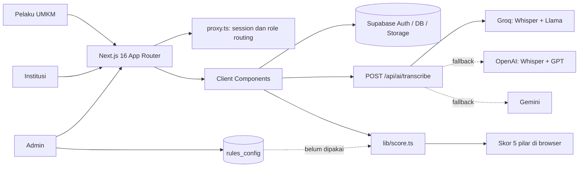
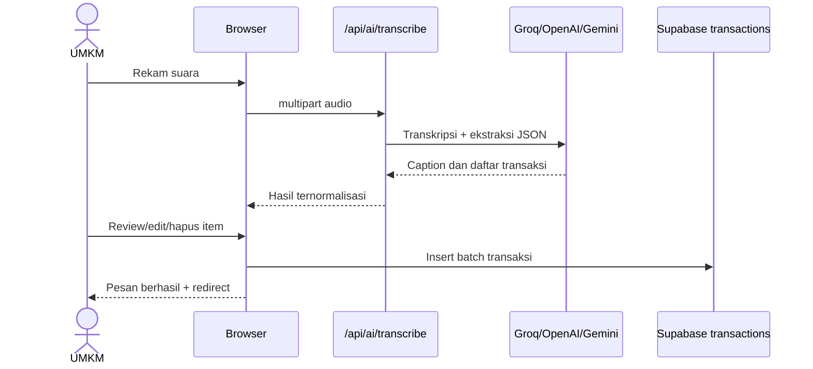

# Konteks Lengkap Codebase berkembang.id

> Dokumen ini disusun dari pembacaan seluruh source code, konfigurasi, aset, dan 18 halaman PRD yang ada di repository pada 23 Agustus 2026. Tujuannya adalah menjadi konteks siap-tempel untuk sesi brainstorming dengan GPT, sekaligus membedakan secara tegas antara visi produk, fitur yang benar-benar bekerja, fitur mock/static, dan fitur yang baru ada di PRD.

## 1. Cara menggunakan dokumen ini

Untuk brainstorming, unggah atau tempel dokumen ini ke GPT lalu gunakan prompt pembuka berikut:

```text
Anda berperan sebagai product strategist, UX architect, dan senior full-stack engineer untuk berkembang.id.

Baca seluruh dokumen konteks codebase yang saya berikan. Jangan menganggap klaim di landing page atau PRD sebagai fitur yang sudah berjalan. Gunakan kolom status implementasi, risiko, dan evidence file untuk membedakan kondisi aktual dari visi.

Sebelum memberi solusi:
1. Rangkum pemahaman Anda tentang produk, tiga aktor, value proposition, dan kondisi implementasi saat ini.
2. Sebutkan asumsi atau informasi yang belum tersedia.
3. Bedakan rekomendasi MVP, pasca-MVP, dan fitur eksperimental.
4. Pertimbangkan keamanan data UMKM, consent, auditability, RLS Supabase, akurasi skor, dan biaya AI.
5. Jangan mengusulkan rewrite total bila perbaikan bertahap masih masuk akal.

Topik brainstorming saya adalah: [TULIS TOPIK/PERTANYAAN DI SINI]
```

Legenda status yang dipakai:

- **Berjalan**: ada implementasi nyata dan terhubung ke sumber data/layanan, walau belum tentu production-ready.
- **Parsial**: sebagian alur bekerja, tetapi masih memiliki bagian mock, tidak tersambung, atau belum aman.
- **Mock/static**: tampilan tersedia, tetapi data atau aksinya dibuat lokal/hardcoded.
- **Belum ada**: disebut di PRD/landing page, tetapi tidak ditemukan implementasinya.
- **Tidak dapat diverifikasi**: bergantung pada konfigurasi eksternal yang tidak ada di repository, misalnya RLS dan schema Supabase produksi.

---

## 2. Ringkasan eksekutif

### 2.1 Apa itu berkembang.id

berkembang.id adalah platform pencatatan dan peningkatan kesiapan pembiayaan untuk UMKM Indonesia. Produk ingin menjembatani tiga pihak:

1. **Pelaku UMKM** mencatat transaksi harian dengan suara atau teks, melihat kondisi kas, melengkapi dokumen, dan memperoleh skor serta langkah peningkatan kesiapan.
2. **Institusi pembiayaan** menemukan UMKM yang sesuai sektor/program, melihat profil anonim, lalu meminta dossier dengan mekanisme persetujuan.
3. **Administrator platform** mengelola UMKM, institusi, mitra, aturan skor, analitik, dan audit log.

Value proposition intinya bukan sekadar aplikasi pembukuan. Produk berusaha mengubah bukti aktivitas usaha yang sederhana menjadi jejak usaha terstruktur, kemudian membantu UMKM memahami apa yang masih kurang sebelum berinteraksi dengan lembaga pembiayaan.

### 2.2 Posisi implementasi saat ini

Codebase sudah berupa prototipe full-stack yang cukup luas, tetapi kematangan tiap portal berbeda:

| Area | Kondisi aktual | Ringkasan |
|---|---|---|
| Landing dan autentikasi | **Parsial menuju berjalan** | UI lengkap, login/register Supabase tersedia, tetapi beberapa klaim produk melampaui implementasi. |
| Portal UMKM | **Paling matang** | Profil, transaksi, laporan, dokumen, dan skor memakai Supabase. Voice transcription memakai provider AI. Beberapa halaman masih statis/mock. |
| Portal institusi | **Mayoritas mock** | Sector gate dan UI eksplorasi ada, tetapi daftar UMKM, dossier, analytics, dan aksi masih hardcoded/tidak tersimpan. |
| Portal admin | **Campuran** | Sebagian besar CRUD mengakses Supabase, tetapi provisioning akun, analytics, dan rules engine belum konsisten/aman. |
| PWA/offline | **Belum ada, selain manifest** | Ada manifest dan metadata, tetapi tidak ada service worker, cache offline, IndexedDB, background sync, atau icon manifest yang tersedia. |
| Privacy/consent | **Belum memadai** | Flow persetujuan dossier tidak ada. Dokumen sensitif justru menggunakan public URL storage. |
| Testing dan observability | **Belum ada** | Tidak ditemukan test suite, monitoring, error tracking, atau CI workflow. |

### 2.3 Kesimpulan arsitektural singkat

- Frontend menggunakan **Next.js 16 App Router**, **React 19**, **TypeScript**, dan **Tailwind CSS 4**.
- Autentikasi dan database menggunakan **Supabase** melalui browser client.
- Hampir semua operasi data dilakukan langsung dari Client Component. Karena itu, keamanan produksi sepenuhnya bergantung pada **Row Level Security (RLS)** Supabase yang tidak tersedia di repository dan tidak dapat diverifikasi.
- Hanya ada satu backend route aplikasi, yaitu `POST /api/ai/transcribe`.
- AI transcription/extraction memiliki urutan fallback **Groq → OpenAI → Gemini**.
- Perhitungan readiness utama dilakukan di browser melalui `lib/score.ts`.
- Terdapat sistem rules admin kedua yang belum dipakai oleh perhitungan readiness UMKM.

---

## 3. Snapshot repository dan teknologi

### 3.1 Ukuran dan struktur

- Sekitar **109 file repository** di luar dependency/build output.
- **29 page routes** dan **1 API route**.
- Sekitar **69 file source** TypeScript/TSX/CSS di `app`, `components`, `lib`, dan `proxy.ts`.
- Kurang lebih **11 ribu baris source** pada area tersebut.
- Repository tidak menyertakan `node_modules` dan tidak menyertakan database migrations.
- `README.md` masih boilerplate Create Next App, sehingga belum dapat menjadi panduan setup proyek.

### 3.2 Dependency utama

| Teknologi | Versi/fungsi |
|---|---|
| Next.js | `16.2.10`, App Router dan `proxy.ts` |
| React / React DOM | `19.2.4` |
| TypeScript | `5.x`, strict mode, no emit |
| Tailwind CSS | `4.x` melalui PostCSS |
| Supabase | `@supabase/supabase-js 2.110.7`, `@supabase/ssr 0.12.3` |
| AI SDK | Groq `1.3.0`, OpenAI `6.49.0`, Google Generative AI `0.24.1` |
| UI | Base UI, shadcn CLI/config, Lucide, Sonner, next-themes |
| Utility | `clsx`, `tailwind-merge`, `class-variance-authority` |

Package scripts hanya mencakup:

```text
npm run dev
npm run build
npm run start
npm run lint
```

Belum ada script test, typecheck khusus, migration, seed, atau code generation.

### 3.3 Konfigurasi penting

- `tsconfig.json`: `strict: true`, `allowJs: true`, `skipLibCheck: true`, `noEmit: true`, module resolution `bundler`, alias `@/*`.
- `next.config.ts`: batas body Server Actions 2 MB dan header `x-middleware-cache: no-cache`. Komentar konfigurasi menyebut header maksimum, tetapi implementasi aktual hanya menambahkan header cache tersebut.
- `public/manifest.json`: mode standalone, start URL `/umkm`, warna brand, dan referensi icon 192/512.
- **Icon `/icons/icon-192.png` dan `/icons/icon-512.png` tidak ada**, sehingga manifest saat ini menunjuk aset yang hilang.
- `globals.css`: design system kustom dengan biru tua `#001b85`, cyan/mint `#7fffe4`, dark surface `#0d1533`, utility animasi, landing styles, auth styles, dan reduced motion.
- Font Inter dimuat melalui `next/font` di root layout, sementara `globals.css` juga mengimpor Google Fonts. Ini berpotensi redundan dan menambah request eksternal.
- Terdapat beberapa string mojibake/encoding rusak, misalnya `“`, `”`, `·`, dan em dash yang rusak pada landing page.

### 3.4 Variabel environment yang digunakan

```text
NEXT_PUBLIC_SUPABASE_URL
NEXT_PUBLIC_SUPABASE_ANON_KEY
GROQ_API_KEY
OPENAI_API_KEY
GEMINI_API_KEY
NEXT_PUBLIC_GEMINI_API_KEY   # fallback yang sebaiknya tidak digunakan untuk secret
```

Tidak ada `.env` yang dikomit. Bila Supabase variable kosong, browser client tetap dibuat dengan string kosong dan hanya memberi warning.

---

## 4. Arsitektur aktual



### 4.1 Batas server dan client

Mayoritas halaman dashboard menggunakan `'use client'`. Browser langsung membaca dan menulis tabel Supabase menggunakan anon key dan session pengguna. Model ini valid bila RLS didesain dengan benar, tetapi repository tidak memiliki:

- SQL migrations;
- deklarasi schema database;
- policy RLS;
- trigger/function database;
- generated TypeScript database types;
- Edge Functions Supabase;
- seed data.

Akibatnya, integritas dan keamanan data lintas-role tidak dapat dinilai hanya dari repository. Proxy Next.js membantu navigasi, tetapi **bukan boundary keamanan database**; request langsung ke Supabase tetap harus diamankan oleh RLS.

### 4.2 Routing dan RBAC

`proxy.ts` melindungi prefix `/umkm`, `/admin`, dan `/institusi`. Pengguna tanpa session diarahkan ke `/auth/login?redirectTo=...`. Setelah login, role menentukan portal:

```text
admin      -> /admin
institution -> /institusi
umkm       -> /umkm
```

Urutan resolusi role saat ini:

1. `user.user_metadata.role`;
2. prefix email khusus `admin@...` atau `institusi@...`;
3. `profiles.role` dari database;
4. fallback `umkm`.

Ini penting karena `user_metadata` biasanya dapat diubah oleh pengguna melalui client auth update. Menjadikannya sumber role paling tinggi dapat membuka eskalasi hak akses bila RLS/API ikut mempercayainya. Role sebaiknya berasal dari sumber server-controlled seperti `app_metadata`, custom claims yang ditandatangani, atau tabel profil yang hanya dapat diubah admin.

Parameter `redirectTo` yang dibuat proxy belum dipakai halaman login; login selalu mengarahkan berdasarkan role.

---

## 5. Peta route lengkap

### 5.1 Publik dan autentikasi

| Route | File | Status | Fungsi aktual |
|---|---|---|---|
| `/` | `app/page.tsx` | Berjalan/static | Landing page komposisi Navbar, hero, trust, produk, institusi, FAQ, CTA, footer. |
| `/terms` | `app/terms/page.tsx` | Berjalan/static | Syarat dan ketentuan. Tanggal pembaruan tertulis Februari 2025. |
| `/auth/login` | `app/auth/login/page.tsx` | Berjalan | Login email/password Supabase dengan tab role visual. |
| `/auth/register` | `app/auth/register/page.tsx` | Parsial | Registrasi dua tahap untuk UMKM/institusi, lalu insert `profiles` dan opsional `institutions`. |
| `POST /api/ai/transcribe` | `app/api/ai/transcribe/route.ts` | Berjalan tetapi berisiko | Transkripsi audio dan ekstraksi transaksi; juga menerima caption teks yang diedit. |

Catatan: tab role di halaman login bukan validasi role akun. Nilainya hanya menjadi fallback bila role tidak ditemukan dari metadata/profil.

### 5.2 Portal UMKM

| Route | Status | Sumber data | Fungsi aktual |
|---|---|---|---|
| `/umkm` | Berjalan | Supabase | Dashboard skor, lima pilar, saldo/arus kas, transaksi hari ini, gap prioritas, dan checklist dokumen. |
| `/umkm/catat` | Berjalan/parsial | AI API + Supabase | Rekam suara, transkripsi, review item, input teks, simpan transaksi. Input teks memakai parser lokal, bukan AI route. |
| `/umkm/laporan` | Berjalan | Supabase | Filter periode, ringkasan keuangan, distribusi kategori, tambah/hapus transaksi, ekspor CSV. |
| `/umkm/score` | Berjalan | Supabase + local scoring | Detail skor readiness lima pilar. |
| `/umkm/gaps` | Berjalan/parsial | Supabase + local scoring | Daftar langkah prioritas; saved gaps menggantikan seluruh default gaps bila tersedia. |
| `/umkm/upload` | Berjalan tetapi berisiko | Supabase Storage + DB | Unggah dan hapus dokumen usaha. Menggunakan public URL untuk dokumen sensitif. |
| `/umkm/profil` | Berjalan/parsial | Supabase Auth + DB + Storage | Edit profil dan avatar. Beberapa field tidak ikut dipersist ke tabel profil. |
| `/umkm/roadmap` | Mock/static | Hardcoded | Tiga fase roadmap dan task statis. |
| `/umkm/aktivitas` | Mock/static | Hardcoded | Timeline aktivitas, filter, pencarian, statistik statis. |
| `/umkm/ai-copilot` | Mock/static | Rule-based local timeout | Respons berdasarkan keyword; tidak memakai model atau data aktual pengguna. |
| `/umkm/notifikasi` | Parsial | Supabase transactions | Menjadikan transaksi sebagai notifikasi. Belum ada unread state, reminders, matching, atau milestone. |

Route yang dirujuk UI tetapi tidak tersedia:

- `/umkm/journey` dari halaman aktivitas;
- `/umkm/riwayat` yang direncanakan PRD, sementara implementasi terdekat adalah `/umkm/laporan`;
- beberapa konsep PRD memakai route pendek `/catat`, `/journey`, dan `/profil`, sedangkan kode memakai namespace `/umkm/...`.

### 5.3 Portal institusi

| Route | Status | Fungsi aktual |
|---|---|---|
| `/institusi` | Mock/static | Sector gate, pilihan sektor, minimum score, stat cards, tabel 10 UMKM anonim, dan modal request dossier. |
| `/institusi/dossiers` | Mock/static | Empat dossier hardcoded dengan tab status; tombol view/verify/reject belum memiliki aksi. |
| `/institusi/analytics` | Mock/static | Statistik dan grafik mingguan hardcoded. |

Layout institusi memakai sidebar desktop dan identitas hardcoded `Bank BRI KUR / Kuliner · Jakarta`. Belum ada versi mobile yang memadai. PRD menggunakan namespace `/dashboard/*`, sedangkan kode aktual menggunakan `/institusi/*`.

### 5.4 Portal admin

| Route | Status | Fungsi aktual |
|---|---|---|
| `/admin` | Parsial | Statistik nyata dari beberapa tabel dan quick links. Missing readiness score diisi nilai 50 sehingga rata-rata dapat bias. |
| `/admin/umkm` | Parsial | Daftar/filter UMKM dan pembuatan row profil. Pembuatan profil tidak membuat akun Auth. |
| `/admin/umkm/[id]` | Berjalan/parsial | Edit detail, readiness override, consistency, status, dan tulis audit log. Override tidak dipakai skor live UMKM. |
| `/admin/institutions` | Parsial | Gabungan tabel `institutions` dan profil ber-role institution; CRUD/toggle/delete. |
| `/admin/institutions/[id]` | Parsial | Detail/edit sumber institution table atau profile. |
| `/admin/mitra` | Berjalan/parsial | CRUD data mitra Supabase. |
| `/admin/mitra/[id]` | Berjalan/parsial | Detail dan edit mitra. |
| `/admin/rules` | Parsial/tidak tersambung | Editor bobot dan threshold rules, preview, simpan/publish `rules_config`; belum dipakai `lib/score.ts`. |
| `/admin/analytics` | Parsial/mock | Counts tertentu nyata, tetapi seri mingguan, retention, request, dan conversion diturunkan dari formula buatan. |
| `/admin/audit` | Berjalan/parsial | Membaca, memfilter, dan mengekspor `audit_logs`; bukan audit menyeluruh semua akses. |
| `/admin/admins` | Parsial dan berisiko | Daftar admin, client-side `auth.signUp`, insert profil, dan hapus profil. Tidak menghapus identity Auth. |

---

## 6. Alur pengguna aktual

### 6.1 Onboarding dan login

#### Registrasi UMKM

1. Pengguna memilih tipe akun UMKM.
2. Mengisi email, password, nama pemilik/usaha, sektor, lokasi, kontak, dan field terkait.
3. `supabase.auth.signUp()` dipanggil dengan metadata role dan profil.
4. Client melakukan insert ke tabel `profiles` menggunakan ID user hasil sign-up.
5. Pengguna diarahkan ke portal.

Kelemahan:

- Error insert profil/institusi tidak ditangani secara transaksional.
- Bila konfirmasi email aktif, session dan timing insert profil perlu diuji.
- Role dikirim dari client.
- Tidak ada schema validation terpusat seperti Zod.
- Belum ada recovery bila Auth user berhasil dibuat tetapi row profil gagal.

#### Login

1. Pengguna memilih tab role secara visual.
2. Login dilakukan dengan `signInWithPassword`.
3. Aplikasi membaca metadata/profil dan mengarahkan ke portal sesuai role.

Pemilihan tab tidak mencegah user institusi login dari tab UMKM; role akun aktual tetap menjadi penentu jika tersedia.

### 6.2 Pencatatan transaksi berbasis suara



Provider AI dicoba berurutan:

1. Groq Whisper Large v3 untuk audio dan Llama 3.3 70B Versatile untuk ekstraksi.
2. OpenAI `whisper-1` dan `gpt-4o-mini` sebagai fallback.
3. Gemini 1.5 Flash dengan audio inline sebagai fallback berikutnya.

Prompt meminta transcript Bahasa Indonesia, nominal `rb/juta`, jenis pemasukan/pengeluaran, kategori, kuantitas, dan item. Hasil kemudian dinormalisasi, termasuk koreksi skala nominal seperti `50rb`.

Masalah penting:

- API route dapat dipanggil publik karena `/api` dikecualikan dari proxy.
- Tidak ada pemeriksaan session, rate limit, quota per user, MIME allowlist, ukuran file, atau validasi schema response AI.
- Caption JSON hanya dibatasi 500 karakter; audio tidak memiliki validasi eksplisit selain batas body platform.
- Bila provider gagal atau key tidak tersedia, kode dapat mengembalikan **transaksi contoh/fiktif Rp50.000**.
- Parser teks lokal juga dapat membuat fallback transaksi Rp100.000; fallback lain dapat memakai Rp150.000.
- Setelah insert database gagal atau user tidak tersedia, UI masih dapat menampilkan pesan bahwa transaksi berhasil disimpan.

Fallback seharusnya tidak pernah menghasilkan data finansial baru. Kondisi gagal harus mengembalikan status “perlu review/tidak dapat diproses” dan mencegah save otomatis.

### 6.3 Laporan keuangan

Halaman laporan mengambil transaksi milik user, lalu menyediakan preset hari/minggu/bulan/semua/custom. UI menghitung:

- total pemasukan;
- total pengeluaran;
- saldo/net;
- kelompok kategori;
- daftar transaksi;
- penambahan manual;
- penghapusan;
- ekspor CSV.

Catatan teknis:

- Belum ada edit transaksi yang sudah tersimpan.
- Custom date menggunakan object waktu/ISO sehingga batas tanggal dapat bergeser karena UTC/timezone.
- CSV hanya meng-escape quote; value yang diawali `=`, `+`, `-`, atau `@` berpotensi menjadi formula ketika dibuka spreadsheet.
- Object URL hasil ekspor tidak terlihat direvoke.

### 6.4 Dokumen dan profil

Jenis dokumen readiness yang dikenali secara exact:

```text
ktp
nib
npwp
laporan_keuangan
rekening_koran
akta
```

Upload menyimpan object ke bucket `documents`, kemudian row metadata ke tabel `documents`, termasuk public URL. Halaman profil mengunggah avatar ke bucket `avatars`.

Kelemahan upload:

- tidak ada validasi MIME, extension, atau ukuran file di client;
- public URL digunakan untuk KTP, NPWP, rekening koran, dan dokumen sensitif lain;
- tidak ada signed URL/expiry/access grant;
- hanya dokumen pertama per tipe yang ditampilkan;
- hapus tanpa konfirmasi dan bukan operasi atomik antara storage dan database;
- consent dan audit pengaksesan institusi belum ada.

Pada update profil, `nib` dan `alamat` masuk ke auth metadata tetapi tidak ikut upsert ke row `profiles`, sehingga data profil dan metadata dapat tidak sinkron. Label “Akun Terverifikasi” tampil tanpa pengecekan status verifikasi aktual.

---

## 7. Readiness scoring: rumus aktual

### 7.1 Sistem skor yang dipakai portal UMKM

`lib/score.ts` menghitung lima pilar dengan total bobot 100%:

| Pilar | Bobot | Rumus aktual |
|---|---:|---|
| Legalitas | 25% | Baseline 10; ada nama usaha saja 40; ada NIB saja 75; ada NIB dan nama usaha 100. |
| Konsistensi | 20% | `min(100, jumlah_transaksi × 10)`. Ini menghitung jumlah transaksi, bukan hari berturut-turut. |
| Kelengkapan dokumen | 25% | Jumlah dari enam tipe dokumen wajib dibagi enam, lalu ×100. |
| Aktivitas usaha | 15% | Jika pemasukan > 0: margin bersih/pemasukan ×100, dibatasi minimum 20 dan maksimum 100. Tanpa pemasukan = 0. |
| Data pendukung | 15% | Baseline 20; ada lokasi **atau** sektor = 60; ada lokasi, sektor, dan telepon = 100. Telepon saja tidak menaikkan nilai. |

Total:

```text
round(
  legalitas × 0.25 +
  konsistensi × 0.20 +
  dokumen × 0.25 +
  aktivitas × 0.15 +
  dataPendukung × 0.15
)
```

Label hasil:

| Skor | Label/interpretasi |
|---:|---|
| 80–100 | Sangat baik / siap |
| 60–79 | Cukup / fondasi tersedia |
| 40–59 | Perlu melengkapi dokumen/data |
| 0–39 | Belum siap |

Konsekuensi desain rumus:

- Sepuluh transaksi langsung memberi skor konsistensi 100, meskipun semuanya dimasukkan pada hari yang sama.
- Usaha rugi tetap mendapatkan aktivitas minimum 20 selama ada pemasukan.
- Baseline pilar legalitas dan data pendukung memberi skor walau data hampir kosong.
- Keberadaan dokumen dihitung, tetapi status verifikasi/validitas/masa berlaku tidak dinilai.
- Tidak ada industry-specific rule, recency, tren omzet, volatility, atau kualitas data.

### 7.2 Gap detector

Gap default dan poin potensial yang ditampilkan:

| Kondisi | Poin yang diklaim |
|---|---:|
| Belum punya NIB | +15 |
| Belum upload KTP | +12 |
| Belum punya NPWP | +10 |
| Transaksi kurang dari 10 | +10 |
| Belum upload laporan keuangan | +8 |
| Belum upload rekening koran | +8 |
| Lokasi/sektor belum lengkap | +6 |

Setiap gap menyertakan alasan, langkah perbaikan, dan route tujuan. Namun jumlah “poin potensial” tidak selalu identik dengan perubahan matematis pada weighted score dan totalnya dapat melampaui ruang kenaikan skor aktual.

Bila row terbaru `readiness_analyses.gaps` berisi data, seluruh gap lokal digantikan oleh custom gaps tersebut, bukan digabung. Di layout, badge jumlah gap hanya memakai saved analysis sehingga dapat menampilkan 0 meski detector lokal menemukan gap.

### 7.3 Sistem rules admin yang berbeda

Halaman `/admin/rules` menyimpan konfigurasi empat komponen:

| Komponen admin | Bobot default |
|---|---:|
| Konsistensi | 35% |
| Kas | 35% |
| Legalitas | 25% |
| Stabilitas | 5% |

Sistem ini berbeda dari lima pilar portal UMKM dan saat ini **tidak dibaca oleh `lib/score.ts`**. Threshold yang disimpan juga belum dipakai. Preview admin membuat nilai komponen turunan dari `profile.readiness_score`, bukan menghitung data sumber. Readiness override pada halaman detail UMKM pun tidak dipakai oleh skor live portal UMKM.

Artinya saat ini ada tiga konsep nilai yang dapat berbeda:

1. skor live lima pilar dari `lib/score.ts`;
2. `profiles.readiness_score` yang dapat diubah admin;
3. rules empat komponen di `rules_config`.

Ini perlu disatukan menjadi satu source of truth yang versioned, explainable, dan dapat diaudit.

---

## 8. Model data yang dapat diinferensikan

> Ini bukan schema resmi. Daftar berikut diturunkan dari query dan payload dalam source code. Tipe, constraint, index, foreign key, dan RLS aktual tidak tersedia di repository.

### 8.1 Tabel yang digunakan kode

#### `profiles`

Field yang dirujuk:

```text
id, email, role, name,
nama_pemilik, nama_usaha, sektor_usaha, lokasi, alamat, phone, nib,
avatar_url,
nama_institusi, jenis_institusi, nama_contact,
readiness_score, konsistensi_days, status,
created_at, updated_at
```

Digunakan sebagai profil lintas-role: UMKM, institution, dan admin.

#### `transactions`

```text
id, user_id, item, qty, type, nominal, kategori, tanggal, created_at
```

`type` diharapkan pemasukan/pengeluaran. Tabel menjadi sumber laporan dan scoring aktivitas/konsistensi.

#### `documents`

```text
id, user_id, name, doc_type, storage_path, file_url,
file_size, mime_type, status, created_at
```

#### `readiness_analyses`

```text
id?, user_id, total_score, gaps, ai_summary, created_at
```

#### `institutions`

```text
id, name, type, programs_count, active
```

#### `mitra`

```text
id, name, type, coverage, umkm_managed, active
```

#### `rules_config`

```text
id?, version, weights (JSON), thresholds (JSON),
is_active, created_by, created_at
```

#### `audit_logs`

```text
id, user_email, action, details, status, timestamp?, created_at
```

### 8.2 Storage bucket

| Bucket | Isi | Implementasi akses |
|---|---|---|
| `documents` | KTP, NIB, NPWP, laporan keuangan, rekening koran, akta | Upload lalu `getPublicUrl` |
| `avatars` | Foto profil pengguna | Upload lalu `getPublicUrl` |

### 8.3 Entitas PRD yang belum dipakai kode

PRD merencanakan atau mengimplikasikan tabel/alur tambahan berikut, tetapi tidak ditemukan query atau implementasinya:

- `umkm_activities`;
- `umkm_achievements`;
- `umkm_streaks`;
- `umkm_referrals`;
- dossier requests dan consent grants;
- programs dan program eligibility;
- institution users/memberships;
- access grants atau document access logs;
- offline mutation queue/sync state;
- notification preferences/delivery log.

---

## 9. Detail tiap area produk

### 9.1 Landing page

Landing menonjolkan positioning voice-first, kesiapan pembiayaan, portal institusi, dan kemampuan tetap berjalan saat internet tidak stabil. Struktur komponen:

- Navbar dengan navigasi section dan CTA;
- Hero dengan ilustrasi produk;
- trust/how-it-works section;
- rangkaian product feature preview;
- section khusus institusi;
- FAQ;
- final CTA;
- footer.

Hal yang baik:

- bahasa produk cukup mudah dipahami UMKM;
- terdapat disclaimer bahwa skor bukan jaminan pembiayaan;
- ada skip link, focus styles, dan reduced motion;
- value proposition tiga pihak cukup jelas.

Gap klaim terhadap implementasi:

- klaim offline belum didukung service worker atau local queue;
- fitur institusi digambarkan seperti workflow nyata, padahal masih mock;
- security/privacy claim lebih kuat daripada evidence kode;
- CTA utama banyak menuju `/umkm`, sehingga pengguna baru dibawa ke login, bukan registrasi;
- alamat kontak hanya `mailto:halo@berkembang.id`;
- beberapa string memiliki encoding rusak.

### 9.2 Shell/dashboard UMKM

Layout UMKM menyediakan:

- sidebar desktop bertingkat;
- bottom navigation mobile;
- tombol microphone/FAB di tengah;
- user avatar/menu;
- notification popover;
- recent transactions;
- subscription realtime insert transaksi.

Subscription membuka channel terhadap insert transaksi dan baru memfilter `user_id` di callback client. Isolasi row kembali bergantung pada RLS. Sebaiknya filter subscription diterapkan di subscription query bila didukung dan tetap diamankan RLS.

Beberapa inkonsistensi navigasi:

- laporan dapat ditandai sebagai bagian/active state Copilot;
- halaman aktivitas mengarah ke route journey yang tidak ada;
- badge gap dan gap aktual bisa berbeda.

### 9.3 AI Copilot

Halaman diberi nama AI Copilot, tetapi implementasi saat ini:

- menunggu dengan `setTimeout`;
- memetakan keyword ke jawaban rule-based;
- tidak mengirim prompt ke provider AI;
- tidak membaca transaksi, profil, score, atau dokumen pengguna;
- tidak memiliki conversation persistence;
- memuat klaim program/rate KUR hardcoded yang dapat berubah dan membutuhkan sumber resmi serta tanggal berlaku.

Dengan demikian halaman ini sebaiknya dilabel demo sampai benar-benar terhubung ke retrieval/data pengguna dan guardrail finansial.

### 9.4 Portal institusi

Sector gate sudah mewakili konsep penting PRD: institusi memilih sektor yang relevan sebelum melihat kandidat. UI juga memiliki minimum score slider dan kandidat anonim.

Yang belum tersedia:

- query kandidat dari database;
- policy penyamaran data;
- pencarian, filter lokasi/program/konsistensi yang nyata;
- sorting dan pagination nyata;
- eligibility program;
- request dossier tersimpan;
- persetujuan/penolakan oleh UMKM;
- expiry/revocation akses;
- audit akses dokumen;
- viewer dokumen;
- verifikasi/reject dossier;
- notification dua arah;
- analytics nyata.

Modal request dossier saat ini hanya menutup modal. Preview, pagination, dan tombol dossier tidak menjalankan workflow bisnis.

### 9.5 Portal admin

Admin memiliki cakupan UI luas dan banyak query Supabase, tetapi terdapat pola data/integritas yang perlu diperbaiki:

- membuat UMKM dari admin hanya menambah row `profiles`; belum tentu menghasilkan user yang bisa login dan dapat melanggar FK ke `auth.users`;
- membuat admin memakai `supabase.auth.signUp` dari session admin aktif, yang dapat mengubah session browser dan bukan mekanisme provisioning privileged yang tepat;
- hapus admin/institusi berbasis profile tidak menghapus identity Auth;
- institusi berasal dari dua sumber (`institutions` dan `profiles`) lalu digabung berdasarkan nama, sehingga identity dan lifecycle ambigu;
- delete/toggle sebagian dilakukan tanpa confirmation atau transaksi;
- audit hanya dicatat pada aksi tertentu yang secara eksplisit insert log;
- analytics memakai angka turunan/fabrikasi, misalnya weekly series dan retention, sehingga tidak boleh dipresentasikan sebagai telemetry nyata;
- rules dapat dipublish tetapi tidak memengaruhi skor pengguna.

---

## 10. PRD v4: visi dan perbandingan implementasi

Repository menyertakan 18 gambar `PRD_BERKEMBANGID_v4_UMKMInformatif`. Dokumen tersebut bertanggal 20 Juli 2026 dan menggambarkan produk tiga portal dengan prioritas UMKM mobile-first, voice-first, offline-friendly, dan informatif.

### 10.1 Inti visi PRD

- Home UMKM sebagai diferensiasi utama: greeting kontekstual, completion, streak, readiness delta, laba hari ini, grafik 7 hari, AI coach, referral, dan aktivitas terbaru.
- Voice-to-ledger dan photo-to-ledger dengan human review.
- Journey/gamification untuk kebiasaan pencatatan.
- Readiness score yang transparan dan dapat ditindaklanjuti.
- Privacy-first dossier: institusi melihat kandidat anonim lalu meminta akses.
- Institution sector gate, filters, sorting, pagination, dan program matching.
- Admin sebagai control plane untuk data, rules, analytics, dan audit.
- PWA/offline queue dan sinkronisasi saat koneksi pulih.
- Arsitektur yang diusulkan: Server Components default, Server Actions/Edge Functions untuk operasi, React Hook Form + Zod, audit setiap akses sensitif, dan realtime rules.

### 10.2 Matriks gap PRD vs code

| Kemampuan PRD | Status code | Catatan |
|---|---|---|
| Tiga role dan tiga portal | Parsial | Routing tersedia; keamanan role perlu diperkuat. |
| Voice-to-ledger + human review | Berjalan/parsial | Alur tersedia, tetapi fallback dapat membuat data palsu dan API belum dilindungi. |
| Photo-to-ledger/OCR | Belum ada | Tidak ditemukan capture/upload receipt maupun OCR. |
| Laba harian + grafik 7 hari | Parsial | Total dan laporan tersedia; home belum memiliki grafik/tren lengkap seperti PRD. |
| AI Coach personal setelah cukup data | Mock | Copilot lokal dan tidak membaca data aktual. |
| Journey/tugas progresif | Mock | Roadmap sepenuhnya hardcoded. |
| Readiness score transparan | Parsial | Lima pilar tersedia, tetapi formula sederhana dan source of truth ganda. |
| Privacy dan consent dossier | Belum ada | Request/approval/access grant belum dibuat. |
| Profile completion | Parsial | Checklist dokumen ada; completion model PRD belum lengkap. |
| Streak | Belum ada | Angka tertentu hanya hardcoded. |
| Activity feed | Mock | Data aktivitas hardcoded, bukan event log. |
| Referral/WhatsApp | Belum ada | Tidak ditemukan implementasi. |
| Offline capture dan sync | Belum ada | Manifest saja; tidak ada service worker/IndexedDB/queue. |
| Installable PWA | Parsial minimum | Manifest tersedia tetapi icon hilang dan tidak ada service worker. |
| Institution sector gate | UI berjalan | State lokal saja. |
| Institution candidate discovery | Mock | Dataset 10 UMKM hardcoded. |
| Dossier workflow | Mock | Modal/list tersedia, tidak tersimpan dan tanpa consent. |
| Institution analytics | Mock | Semua angka/grafik hardcoded. |
| Admin CRUD | Parsial | Banyak tabel nyata, tetapi identity lifecycle dan keamanan bermasalah. |
| Dynamic rules engine | Disimpan, belum diterapkan | `rules_config` tidak dibaca scoring engine. |
| Admin analytics | Campuran/mock | Sebagian counts nyata, metrik lain direkayasa dari formula. |
| Audit menyeluruh | Parsial | Hanya beberapa mutation tercatat; data access tidak otomatis diaudit. |
| Server Components default | Belum dipenuhi | Dashboard dominan Client Components. |
| Server Actions/Edge Functions | Belum ada | Hanya satu route handler AI. |
| React Hook Form + Zod | Belum ada | Form menggunakan state dan validasi manual. |
| RLS terdokumentasi | Tidak dapat diverifikasi | Policy/migration tidak ada di repository. |
| Realtime rules | Belum ada | Hanya realtime transaction notification. |

### 10.3 Perbedaan versi stack

PRD menyebut Next.js 14+, sedangkan repository menggunakan Next.js 16.2.10. Ini bukan masalah dengan sendirinya, tetapi versi tersebut memiliki perubahan API dan convention. Instruksi repository secara eksplisit meminta membaca dokumentasi lokal `node_modules/next/dist/docs/` sebelum mengubah kode Next.js. Pada snapshot ini `node_modules` belum tersedia, jadi dokumentasi lokal tersebut belum dapat dibaca dan tidak ada perubahan app code yang dilakukan dalam penyusunan dokumen ini.

---

## 11. Risiko dan technical debt terprioritas

### 11.1 Prioritas kritis — sebelum pilot dengan data nyata

1. **Boundary keamanan Supabase tidak terlihat.** Semua client-side query memerlukan RLS ketat per owner dan role. Buat migration, policy test, dan generated types sebagai bagian repository.
2. **Role dari `user_metadata` berpotensi dapat dimanipulasi.** Pindahkan authority ke server-controlled claim atau membership table yang tidak dapat diubah pengguna.
3. **Dokumen sensitif memakai public URL.** Gunakan private bucket, signed URL berumur pendek, consent grant, least privilege, dan access log.
4. **Endpoint AI publik dan billable.** Wajib auth, rate limiting, quota, size/MIME validation, abuse protection, timeout, dan cost telemetry.
5. **Fallback membuat transaksi finansial fiktif.** Hilangkan seluruh fabricated transaction dan jangan pernah menampilkan sukses bila insert gagal.
6. **Provisioning admin dilakukan dari browser.** Gunakan server-only admin API/Edge Function dengan service role yang tidak pernah terekspos, authorization eksplisit, dan audit.
7. **Tidak ada consent dossier.** Jangan memberi institusi akses dokumen/PII sebelum workflow persetujuan, expiry, revoke, purpose limitation, dan audit tersedia.

### 11.2 Prioritas tinggi — validitas produk

1. Satukan tiga sumber skor menjadi satu engine versioned.
2. Definisikan arti readiness: indikator kelengkapan, bukan probabilitas approval, kecuali ada validasi data/model yang sah.
3. Ganti konsistensi dari jumlah transaksi menjadi hari aktif, recency, dan continuity yang benar.
4. Terapkan status verifikasi dokumen, bukan hanya keberadaan upload.
5. Hentikan metrik admin/institusi hardcoded atau beri label tegas sebagai demo.
6. Selaraskan update profil antara auth metadata dan tabel `profiles`.
7. Tambahkan schema validation untuk input user dan output model AI.
8. Perbaiki route/link yang tidak ada dan samakan naming dengan information architecture final.
9. Jangan mengklaim offline/PWA/privacy/security sebelum evidence teknis tersedia.
10. Hindari hardcoded informasi finansial yang mudah berubah tanpa sumber dan tanggal berlaku.

### 11.3 Prioritas menengah — maintainability dan UX

- Tambahkan unit test untuk scoring/parser, integration test Supabase/RLS, dan end-to-end test tiga role.
- Kurangi penggunaan `any` dengan generated Supabase types dan schema inference.
- Pecah halaman besar seperti laporan/catat/register menjadi domain components dan hooks.
- Pindahkan data fetching sensitif ke server boundary yang tepat.
- Tambahkan loading, empty, error, retry, dan optimistic-state yang jujur.
- Tangani timezone tanggal secara eksplisit untuk Asia/Jakarta.
- Sanitasi CSV dari formula injection dan revoke object URL.
- Tambahkan modal semantics, Escape, focus trap, keyboard navigation, dan label aksesibilitas.
- Perbaiki UI mobile portal institusi/admin bila memang digunakan lewat ponsel.
- Hapus atau integrasikan komponen UI yang belum digunakan.
- Perbaiki encoding mojibake.
- Hilangkan aset default Next/Vercel bila tidak diperlukan.
- Buat README setup, architecture decision records, schema, seed/demo account, dan deployment guide.
- Tambahkan logging terstruktur, error tracking, AI request telemetry, dan privacy-aware analytics.

---

## 12. Rekomendasi roadmap realistis

### Fase 0 — safety dan kejujuran demo

- Hilangkan transaksi fallback fiktif.
- Pastikan error save benar-benar terlihat sebagai error.
- Lindungi AI route dan secret.
- Audit dan uji RLS semua tabel/bucket.
- Ubah storage dokumen menjadi private.
- Tandai/lepaskan angka dan aksi mock dari UI production.
- Perbaiki role source dan provisioning akun admin.

### Fase 1 — closed-loop MVP UMKM

- Stabilkan onboarding, profil, pencatatan suara/manual, laporan, dokumen, dan scoring.
- Satukan score engine dan buat snapshot/version history.
- Implementasikan streak/aktivitas dari event nyata, bukan hardcoded.
- Buat journey minimum yang diturunkan dari gap aktual.
- Tambahkan tests untuk nominal Indonesia, parser, score, dan RLS.
- Validasi dengan kelompok kecil UMKM sebelum menambah banyak fitur.

### Fase 2 — dossier dan consent

- Buat request → notification → review UMKM → approve/reject → scoped access → expire/revoke.
- Institusi hanya melihat agregat anonim sebelum approval.
- Audit setiap view/download dokumen sensitif.
- Pisahkan organization, member, program, dan permission model institusi.
- Hubungkan candidate filters ke data readiness yang tervalidasi.

### Fase 3 — PWA dan ketahanan koneksi

- Tambahkan icon valid, service worker, app installability, dan offline shell.
- Simpan draft transaksi secara lokal.
- Buat mutation queue dengan idempotency key dan conflict strategy.
- Tampilkan status offline/sync dengan jelas.
- Jangan menyimpan dokumen sensitif offline tanpa threat model dan enkripsi yang sesuai.

### Fase 4 — intelligence yang dapat dipercaya

- AI Coach menggunakan data teragregasi dan terotorisasi milik user.
- Structured output tervalidasi schema.
- Recommendation provenance: jelaskan data apa yang menjadi dasar saran.
- Evaluasi akurasi transkripsi untuk dialek, noise, dan cara menyebut nominal Indonesia.
- Photo-to-ledger hanya setelah voice-to-ledger stabil.
- Rules engine memiliki versioning, simulation, approval, rollback, dan effective date.

---

## 13. Pertanyaan untuk sesi brainstorming

### Produk dan positioning

1. Apakah north-star produk adalah kebiasaan pencatatan, peningkatan readiness, atau matchmaking pembiayaan?
2. Apakah skor dimaksudkan sebagai checklist kesiapan administratif atau prediksi peluang disetujui? Implikasi regulasi dan datanya sangat berbeda.
3. Siapa pengguna pertama yang paling sempit: pedagang mikro harian, kuliner, toko kelontong, atau segmen lain?
4. Apa alasan UMKM kembali setiap hari setelah novelty voice recording berakhir?
5. Apakah institusi benar-benar membutuhkan ranking, atau lebih membutuhkan evidence yang konsisten dan dapat diaudit?

### Data dan trust

1. Data minimum apa yang boleh terlihat sebelum UMKM memberi consent?
2. Siapa yang memverifikasi dokumen dan bagaimana status/masa berlaku dikelola?
3. Berapa lama institusi boleh mengakses dossier, dan bagaimana UMKM mencabut akses?
4. Apakah nominal transaksi mentah perlu dibagikan, atau cukup agregat/range?
5. Bagaimana pengguna memperbaiki transcript/transaction sehingga koreksi menjadi feedback tanpa mengorbankan privasi?

### Scoring

1. Mengapa bobot saat ini dipilih dan apakah sudah divalidasi dengan institusi?
2. Bagaimana mencegah gaming, misalnya memasukkan 10 transaksi kecil di hari yang sama?
3. Apakah score harus berbeda per sektor/program?
4. Bagaimana menampilkan confidence, freshness, dan alasan perubahan skor?
5. Bagaimana aturan baru berlaku terhadap score historis: recompute atau snapshot?

### Teknis

1. Apakah Supabase schema/RLS sudah ada di project remote tetapi belum dikomit?
2. Apakah ada kebutuhan multi-tenant institution dan beberapa user per institusi?
3. Berapa target volume audio, transaksi harian, dan concurrent users?
4. Provider AI mana yang diizinkan dari sisi lokasi pemrosesan data dan biaya?
5. Apakah offline benar-benar kebutuhan hasil riset, atau masih asumsi PRD?

### Validasi bisnis

1. Apa bukti bahwa institusi bersedia memakai readiness score eksternal?
2. Siapa yang menanggung biaya AI dan verifikasi dossier?
3. Apakah monetisasi berasal dari institusi, program pemerintah, subscription UMKM, atau referral?
4. Apa metrik pilot: pencatatan aktif 7 hari, kelengkapan profil, dossier approved, atau pembiayaan tersalurkan?
5. Apa batas klaim pemasaran dan disclaimer yang sudah ditinjau legal/compliance?

---

## 14. Inventaris file source dan tanggung jawab

Bagian ini membantu GPT menemukan evidence dan memahami pembagian modul. Semua file code utama di repository dicakup di bawah.

### 14.1 Root dan konfigurasi

| File | Peran |
|---|---|
| `AGENTS.md` | Aturan kontribusi: Next.js versi proyek memiliki breaking changes; baca docs lokal sebelum coding. |
| `CLAUDE.md` | Instruksi/konteks agent tambahan di repository. |
| `package.json` | Dependency dan npm scripts. |
| `package-lock.json` | Lock dependency. |
| `tsconfig.json` | Konfigurasi TypeScript dan alias. |
| `next.config.ts` | Konfigurasi Next, body limit Server Actions, dan response header. |
| `eslint.config.mjs` | ESLint config. |
| `postcss.config.mjs` | Pipeline PostCSS/Tailwind. |
| `components.json` | Konfigurasi shadcn/base style dan aliases. |
| `skills-lock.json` | Lock skill desain yang pernah digunakan. |
| `proxy.ts` | Refresh session Supabase, proteksi route, dan redirect role. |
| `README.md` | Masih README default Create Next App. |

### 14.2 Shared library

| File | Peran |
|---|---|
| `lib/supabase.ts` | Singleton browser Supabase client dari public env. |
| `lib/score.ts` | Model data readiness, kalkulasi lima pilar, label, dan gap detector. |
| `lib/utils.ts` | Helper class name `cn()`. |

### 14.3 Root app, public, dan auth

| File | Peran |
|---|---|
| `app/layout.tsx` | Root HTML, metadata, manifest, favicon, dan Inter font. |
| `app/globals.css` | Tailwind import, design tokens, landing/auth utilities, animations, responsive dan reduced-motion rules. |
| `app/page.tsx` | Komposisi landing page. |
| `app/terms/page.tsx` | Syarat dan ketentuan statis. |
| `app/auth/layout.tsx` | Layout auth. |
| `app/auth/login/page.tsx` | Login Supabase dan role redirect. |
| `app/auth/register/page.tsx` | Wizard registrasi UMKM/institusi dan insert profil. |
| `app/api/ai/transcribe/route.ts` | Orkestrasi transkripsi/ekstraksi Groq, OpenAI, Gemini, normalization, dan fallback. |
| `app/icon.png` | App icon yang dipakai metadata file convention. |

### 14.4 Portal UMKM

| File | Peran |
|---|---|
| `app/(umkm)/layout.tsx` | Shell UMKM desktop/mobile, profile, nav, realtime transaksi, dan notifikasi ringkas. |
| `app/(umkm)/umkm/page.tsx` | Dashboard home, score, pilar, keuangan, gap, dokumen. |
| `app/(umkm)/umkm/catat/page.tsx` | MediaRecorder, audio upload, text parser, review, batch save. |
| `app/(umkm)/umkm/laporan/page.tsx` | Laporan transaksi, date filter, CRUD terbatas, chart bar, CSV. |
| `app/(umkm)/umkm/score/page.tsx` | Detail readiness lima pilar. |
| `app/(umkm)/umkm/gaps/page.tsx` | Prioritas peningkatan readiness. |
| `app/(umkm)/umkm/upload/page.tsx` | Upload/delete dokumen Supabase Storage. |
| `app/(umkm)/umkm/profil/page.tsx` | Edit profil/auth metadata dan avatar. |
| `app/(umkm)/umkm/roadmap/page.tsx` | Roadmap statis tiga fase. |
| `app/(umkm)/umkm/aktivitas/page.tsx` | Timeline aktivitas hardcoded. |
| `app/(umkm)/umkm/ai-copilot/page.tsx` | Chat-like UI dengan respons lokal berbasis keyword. |
| `app/(umkm)/umkm/notifikasi/page.tsx` | Tampilan notifikasi yang diturunkan dari transaksi. |

### 14.5 Portal institusi

| File | Peran |
|---|---|
| `app/(dashboard)/layout.tsx` | Shell/sidebar institusi dan logout. |
| `app/(dashboard)/institusi/page.tsx` | Sector gate, kandidat mock, score filter, dan modal dossier. |
| `app/(dashboard)/institusi/dossiers/page.tsx` | Daftar dossier mock dan status tabs. |
| `app/(dashboard)/institusi/analytics/page.tsx` | Analytics institusi hardcoded. |

### 14.6 Portal admin

| File | Peran |
|---|---|
| `app/(admin)/layout.tsx` | Shell admin responsive, nav, dan logout. |
| `app/(admin)/admin/page.tsx` | Overview/counts Supabase. |
| `app/(admin)/admin/umkm/page.tsx` | List/search/create profil UMKM. |
| `app/(admin)/admin/umkm/[id]/page.tsx` | Detail/edit UMKM dan audit perubahan. |
| `app/(admin)/admin/institutions/page.tsx` | Merge/list/create/toggle/delete institusi. |
| `app/(admin)/admin/institutions/[id]/page.tsx` | Detail/edit institusi/profile institution. |
| `app/(admin)/admin/mitra/page.tsx` | List dan CRUD mitra. |
| `app/(admin)/admin/mitra/[id]/page.tsx` | Detail/edit mitra. |
| `app/(admin)/admin/rules/page.tsx` | Konfigurasi bobot/threshold, preview, publish. |
| `app/(admin)/admin/analytics/page.tsx` | Dashboard metrik campuran real dan derived/mock. |
| `app/(admin)/admin/audit/page.tsx` | Audit log, filter, dan export. |
| `app/(admin)/admin/admins/page.tsx` | Manajemen profil/admin account dari browser. |

### 14.7 Shared components

| File | Peran |
|---|---|
| `components/CitySelect.tsx` | Searchable dropdown lokasi dengan daftar kota/kabupaten hardcoded dan opsi Lainnya. |
| `components/DateTimePicker.tsx` | Kalender 6 minggu, rentang 2015–2045, optional time dan preset interval 5 menit. |
| `components/Modal.tsx` | Portal modal, body scroll lock, dan backdrop click. Belum ada focus trap/Escape/dialog semantics lengkap. |
| `components/icons.tsx` | Re-export ikon Lucide terpusat; tidak terlihat dominan dipakai. |

### 14.8 Landing components

| File | Peran |
|---|---|
| `components/landing/Navbar.tsx` | Header dan navigasi landing. |
| `components/landing/Hero.tsx` | Hero value proposition dan CTA. |
| `components/landing/TrustSection.tsx` | Cara kerja/trust story. |
| `components/landing/ProductSections.tsx` | Narasi fitur dan product previews. |
| `components/landing/ProductPreview.tsx` | Visual/mockup produk. |
| `components/landing/InstitutionSection.tsx` | Value proposition institusi. |
| `components/landing/FAQ.tsx` | FAQ accordion/content. |
| `components/landing/FinalCTA.tsx` | CTA akhir. |
| `components/landing/Footer.tsx` | Footer dan links. |
| `components/landing/atoms/ActionLink.tsx` | Primitive action link. |
| `components/landing/atoms/Badge.tsx` | Primitive badge landing. |
| `components/landing/atoms/Container.tsx` | Container layout. |
| `components/landing/molecules/CTAButtonGroup.tsx` | Grup CTA. |
| `components/landing/molecules/SectionHeader.tsx` | Heading section reusable. |

### 14.9 UI primitives

Komponen berikut merupakan primitive shadcn/Base UI, tetapi pencarian import aplikasi tidak menunjukkan pemakaian aktif dari alias `@/components/ui`:

```text
components/ui/badge.tsx
components/ui/button.tsx
components/ui/card.tsx
components/ui/input.tsx
components/ui/label.tsx
components/ui/progress.tsx
components/ui/select.tsx
components/ui/separator.tsx
components/ui/slider.tsx
components/ui/sonner.tsx
components/ui/switch.tsx
components/ui/tabs.tsx
```

### 14.10 Aset publik

- `public/images/PRD_BERKEMBANGID_v4_UMKMInformatif_page-0001.jpg` sampai `page-0018.jpg`: 18 halaman PRD yang menjadi pembanding visi.
- `public/logo/logo berkembang.webp`: logo utama.
- `public/logo/favicon.png`: favicon brand.
- `public/logo/bank-indonesia.svg`: aset logo Bank Indonesia.
- `public/manifest.json`: web app manifest.
- `public/file.svg`, `globe.svg`, `next.svg`, `vercel.svg`, `window.svg`: aset default template yang tampaknya belum dibersihkan.
- Aset icon yang dirujuk manifest di folder `/icons` tidak ada.

---

## 15. Hal yang belum dapat disimpulkan dari repository

Informasi berikut perlu diberikan agar diskusi arsitektur production dapat akurat:

1. SQL schema Supabase aktual, indexes, constraints, triggers, dan RLS policies.
2. Apakah storage bucket produksi public atau private dan policy masing-masing.
3. Konfigurasi email confirmation, redirect URL, dan auth provider.
4. Data demo vs data pengguna nyata yang sudah ada di project Supabase.
5. Deployment Vercel, domain, region, observability, dan secret management.
6. Legal basis, consent text, retention, deletion, dan compliance untuk dokumen UMKM.
7. Hasil user research dengan UMKM dan institusi.
8. Formula readiness yang sudah disepakati domain expert.
9. Target SLA, volume user, budget AI, dan batas ukuran audio.
10. Apakah UI saat ini dipakai untuk demo hackathon saja atau akan langsung menjadi pilot production.

---

## 16. Brief produk siap-tempel untuk GPT

```text
Nama produk: berkembang.id

Konteks:
berkembang.id adalah platform tiga sisi untuk membantu UMKM Indonesia mencatat transaksi dengan suara/teks, memahami arus kas dan kesiapan pembiayaan, melengkapi dokumen, lalu—dengan persetujuan—ditemukan oleh institusi pembiayaan. Admin mengelola ekosistem, rules, analytics, dan audit.

Stack aktual:
Next.js 16.2 App Router, React 19, TypeScript, Tailwind 4, Supabase Auth/DB/Storage, Groq/OpenAI/Gemini. Mayoritas dashboard adalah Client Components dan langsung mengakses Supabase. Hanya ada satu API route untuk transkripsi/ekstraksi transaksi.

Kondisi aktual:
- Portal UMKM paling matang: profil, transaksi, laporan, upload dokumen, dan skor tersambung Supabase.
- Voice-to-ledger bekerja tetapi endpoint belum auth/rate-limit dan fallback dapat membuat data fiktif.
- AI Copilot, roadmap, dan activity masih hardcoded/mock.
- Portal institusi hampir seluruhnya mock; consent dan dossier workflow belum ada.
- Portal admin memiliki CRUD nyata, tetapi provisioning account, analytics, audit, dan rules masih parsial.
- PWA hanya memiliki manifest; offline dan icon manifest belum tersedia.
- RLS/schema/migrations tidak ada di repository sehingga keamanan database belum dapat diverifikasi.

Scoring aktual:
Lima pilar: legalitas 25%, jumlah transaksi sebagai konsistensi 20%, enam dokumen 25%, margin sebagai aktivitas 15%, dan data pendukung 15%. Admin memiliki sistem empat komponen berbeda yang tidak terhubung. Profile readiness override juga tidak digunakan oleh skor live.

Risiko terbesar:
1. role mengutamakan user-editable user_metadata;
2. dokumen sensitif memakai public URL;
3. endpoint AI publik/billable;
4. fallback transaksi fiktif dan success message saat insert gagal;
5. client-side admin provisioning;
6. consent dossier belum ada;
7. angka mock terlihat seperti data nyata;
8. klaim offline/security lebih maju daripada implementasi.

Prinsip rekomendasi:
- utamakan safety, RLS, privacy, consent, dan kejujuran data sebelum ekspansi fitur;
- stabilkan closed-loop UMKM terlebih dahulu;
- satukan dan versioning score engine;
- jadikan institusi sebagai permissioned workflow, bukan dashboard yang langsung membuka data;
- gunakan AI sebagai assistive extraction/coaching dengan human review, validation, provenance, dan failure yang aman;
- prioritaskan perbaikan bertahap, bukan rewrite tanpa alasan.

Pertanyaan brainstorming saya:
[ISI PERTANYAAN DI SINI]
```

---

## 17. Ringkasan satu paragraf

berkembang.id sudah memiliki fondasi prototipe yang kuat untuk demo UMKM—terutama pencatatan suara, transaksi, laporan, dokumen, dan visual readiness—namun belum menjadi platform pembiayaan tiga sisi yang production-ready. Langkah paling bernilai bukan menambah fitur sebanyak mungkin, melainkan menutup loop pencatatan UMKM dengan aman, menjadikan score konsisten dan dapat dijelaskan, membangun consent-based dossier, mengamankan Supabase serta endpoint AI, dan memastikan semua angka/aksi yang ditampilkan benar-benar bersumber dari data nyata. Setelah trust layer tersebut kokoh, fitur institusi, offline, gamification, OCR, dan AI coaching dapat dibangun bertahap berdasarkan validasi pengguna.
