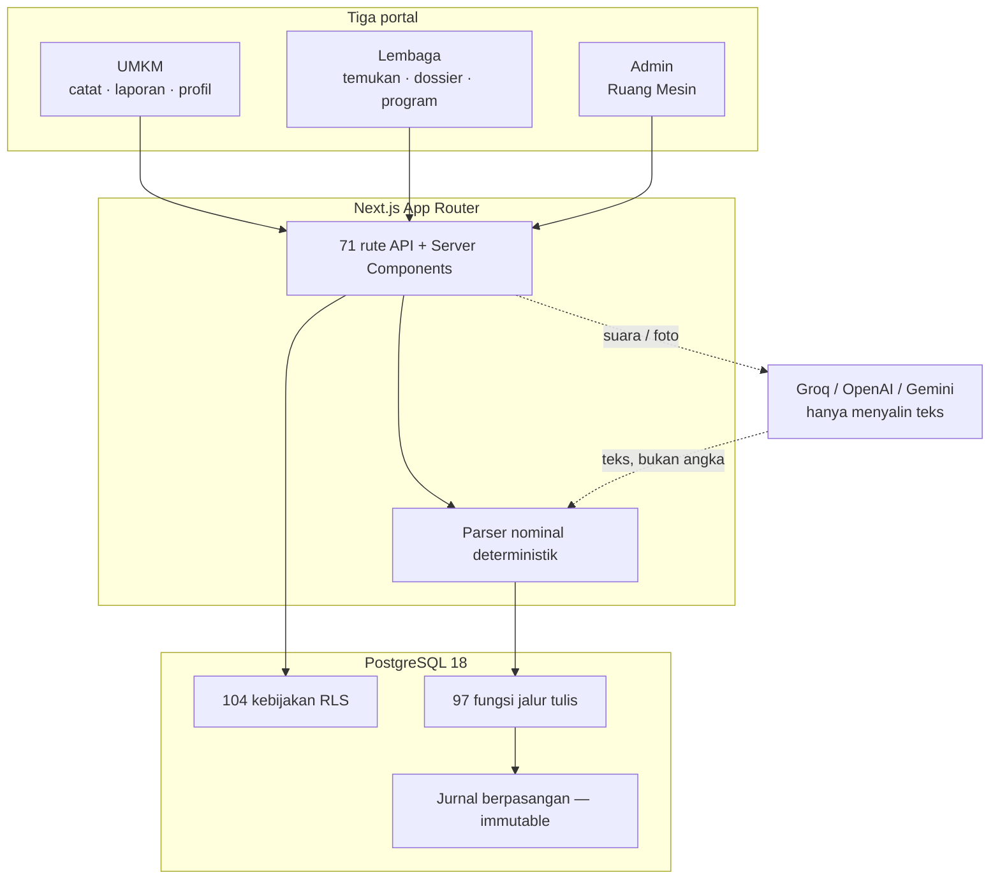

# Teknologi BERKEMBANG.ID

**Bahan presentasi · 9 September 2026**
Apa yang sudah dibangun, dan keputusan teknis yang membentuknya.

> **Satu kalimat:**
> Kami membuat catatan usaha UMKM yang bisa dibaca bank — dengan AI yang **tidak pernah diizinkan mengarang satu angka pun**, dan basis data yang menegakkan aturannya, bukan layar yang mengingatkan.

---

## 1. Angka proyek

| | |
| --- | --- |
| Migrasi basis data | **73 berkas · 22.638 baris SQL** |
| Tabel | **70**, seluruhnya dengan RLS aktif |
| Kebijakan RLS | **104** |
| Fungsi basis data | 97 di `public` (jalur tulis resmi) + 58 helper di `private` |
| Kode aplikasi | 288 berkas · 36.707 baris TypeScript/TSX |
| Rute API | 71 |
| Uji | **790 unit · 104 kontrak migrasi · 8 spec E2E** |
| Portal | 3 (UMKM · Lembaga · Admin) |

---

## 2. Tumpukan teknologi

| Lapis | Pilihan | Versi |
| --- | --- | --- |
| Framework | Next.js App Router (Turbopack) | 16.2 |
| UI | React · TypeScript · Tailwind v4 · shadcn/ui di atas Base UI | 19.2 · 5 · 4 |
| Basis data | PostgreSQL 18 lewat Supabase (Auth · Storage · RLS · RPC) | — |
| Validasi | Zod (satu skema dipakai klien dan server) | 4 |
| AI | Groq (transkripsi & pembacaan gambar) · OpenAI · Gemini | — |
| Uji | Vitest · Playwright · verifikasi migrasi di PostgreSQL asli | 4 · 1.6 |
| PDF | @react-pdf/renderer | 4 |

**Kenapa Supabase, bukan backend sendiri:** RLS memindahkan batas keamanan dari kode aplikasi ke basis data. Rute API yang lupa memeriksa kepemilikan tetap tidak bisa membaca data orang lain — kebijakan RLS-lah yang menolak, bukan `if` di dalam rute.

---

## 3. Arsitektur: tiga portal, satu kebenaran



Ketiga portal memakai **satu basis data yang sama**. Yang memisahkan mereka bukan tiga aplikasi, melainkan RLS: peran efektif seseorang ditentukan dari keanggotaan yang tercatat, dan setiap tabel menolak baris yang bukan haknya.

---

## 4. Keputusan teknis yang membedakan

### 4.1 AI tidak pernah mengeluarkan angka

Ini klaim terkuat produk ini, dan ia **ditegakkan, bukan dijanjikan**.

```
Suara  → Whisper  →┐
Foto   → OCR      →┼→ TEKS → parser nominal deterministik → angka → kartu konfirmasi
Ketik  →          →┘         (modul terpisah, 5,9 KB, 39% dari anggaran)
```

Model bahasa hanya **menyalin** yang terdengar atau terlihat. Setiap nominal dilahirkan ulang oleh `modules/nominal-parser` dari teks yang sama. Kalau model sempat mengembalikan angka, penjaga `enforceParserAmounts` / `enforceReceiptAmount` **menimpanya** dan mencatat berapa kali itu terjadi.

Hitungan itu tersimpan di kolom `transaction_captures.amount_overrides`, dan tampil di dasbor admin sebagai lampu **"Nominal dari model" yang harus nol**. Janji yang tidak bisa ditunjukkan angkanya hanya klaim.

**Struk punya aturannya sendiri.** Angka terbesar di nota sering kali "TUNAI" — uang yang disodorkan pembeli, bukan yang dibelanjakan. Pemeringkat kandidat memberi skor per baris dari kata di sekitarnya (`TOTAL` naik, `KEMBALIAN` turun), dan ketika dua kandidat terlalu rapat ia **menolak menebak** — pemiliknya yang memilih. 38 kasus uji menjaga aturan itu.

### 4.2 Pembukuan berpasangan yang tidak bisa disunting

Bagan akun SAK EMKM, jurnal berpasangan penuh, dan **jurnal tidak pernah di-`update`**. Koreksi = pembalikan bertanggal di periodenya + posting ulang. Trigger basis data yang menolak, bukan kesepakatan tim.

Penyusutan garis lurus dengan nilai residu, hitung ulang otomatis saat alat dijual atau umur manfaatnya berubah — semuanya di dalam basis data, sehingga laporan yang dibaca lembaga tidak pernah bisa berbeda dari catatan yang dibaca pemiliknya.

### 4.3 Privasi berlapis

```
Kandidat anonim → permintaan lembaga → ditinjau admin → izin pemilik
      ↓                                                       ↓
 tanpa nama                                         snapshot beku + jejak
```

- Layar Temukan **tidak pernah menyebut nama**; hanya kode kandidat, sektor, wilayah umum.
- Membuka identitas menuntut permintaan yang ditinjau admin, dengan ruang lingkup dan masa berlaku yang tertulis dan tidak bisa diubah setelah terkirim.
- Setiap pembukaan dan unduhan tercatat, **dan terlihat oleh pemilik usahanya**.
- Admin yang perlu melihat isi keuangan harus membuka **tiket 30 menit ber-alasan** — barisnya tidak bisa di-`update` sama sekali, karena satu-satunya jalan untuk "mengakhiri lebih awal" juga bisa dipakai untuk memperpanjang.
- Tidak ada satu pun endpoint admin yang mengembalikan **rupiah per akun UMKM**. Dijaga oleh uji yang menyapu seluruh respons, dan oleh penjaga di dalam migrasi yang memeriksa teks sumber fungsinya sendiri.

### 4.4 Ruang Mesin — portal admin sebagai ruang kendali

- **Sakelar fitur** dengan asimetri yang disengaja: **mematikan cukup peran OPS, menyalakan menuntut SUPER_ADMIN.** Sesuatu yang jebol harus bisa dihentikan cepat oleh siapa pun yang sedang berjaga; mengembalikannya adalah keputusan yang bisa ditunggu.
- **Kill switch yang jatuh anggun**: `capture_voice` dimatikan → layar Catat pemilik **berpindah sendiri** ke mode ketik, tanpa pesan galat. Mode yang mati tidak ditampilkan sebagai tombol kelabu — tombol kelabu mengundang pertanyaan "kenapa saya tidak boleh".
- **Setiap tindakan tulis wajib beralasan**, dan catatannya ditulis dalam transaksi yang sama. Kalau catatannya gagal, tindakannya tidak jadi terjadi.
- **Catatan tindakan hanya bisa bertambah** — trigger, bukan sekadar hak akses, karena seluruh kode server berjalan sebagai peran yang memegang semua hak.
- **Metrik yang belum ada sumbernya menulis "Belum diukur" beserta alasannya**, bukan angka contoh. Dasbor yang sekali saja menampilkan angka karangan tidak akan pernah lagi dipercaya untuk angka yang benar.

### 4.5 Bahasa yang dijaga mesin

Dua kamus ditegakkan oleh `npm run lint:terms`, gagal build kalau dilanggar:

- **Bahasa penilaian kredit** ("skor kredit", "plafon", "layak") dilarang di seluruh produk — kami membentuk catatan usaha, bukan menilai kelayakan pinjaman (POJK 29/2024).
- **Istilah akuntan** ("arus kas", "jurnal", "ekuitas") dilarang di layar pemilik usaha. Bukan karena salah — justru karena benar bagi yang sudah tahu, dan menutup pintu bagi yang belum. Mode Akuntan dikecualikan seluruhnya.

---

## 5. Cara kami membuktikan, bukan meyakini

Gerbang mutu yang harus hijau sebelum apa pun dianggap selesai:

| Perintah | Yang dibuktikannya |
| --- | --- |
| `npm run db:test` | **Migrasi dipasang ke PostgreSQL asli**, lalu diuji perilakunya: RLS lintas akun, jurnal seimbang, trigger menolak, penyusutan benar |
| `npm test` | 790 uji unit |
| `npm run test:integration` | 104 uji kontrak migrasi |
| `npm run lint:terms` | Dua kamus bahasa di atas |
| `npm run db:types:check` | Tipe TypeScript tidak menyimpang dari skema |
| `npm run check:voice-bundle` | Modul suara di klien tetap di bawah 15 KB |
| `typecheck` · `lint` · `build` | Dasar |

**Pelajaran paling mahal dari proyek ini:** `build` dan `typecheck` **tidak pernah bisa membuktikan SQL**. Delapan kerusakan besar sepanjang pengembangan lolos keduanya dan hanya tertangkap oleh `db:test` — termasuk 25 tabel yang kehilangan hak akses, dan penyusutan yang dihitung dua kali setelah koreksi.

Beberapa penjaga bahkan menangkap penulisnya sendiri: penjaga privasi di migrasi metrik menolak migrasi itu sendiri karena kata "nominal" muncul di label lampunya — lalu dipertajam agar mencari rujukan kolom, bukan kata dalam kalimat.

---

## 6. Yang sudah berjalan

**UMKM** — catat lewat suara, foto nota, atau ketik · buku kas & laporan SAK EMKM · kondisi awal usaha · lemari dokumen dengan pembacaan otomatis · tingkat kesiapan · tutup kas harian · ekspor PDF

**Lembaga** — temukan kandidat anonim · shortlist · permintaan akses · dossier berizin ber-watermark · program pembinaan dengan kode gabung · log audit

**Admin** — Ruang Mesin (kesehatan sistem, kualitas AI, biaya) · sakelar fitur · akun demo · kelola UMKM, lembaga, mitra · permintaan akses profil · aturan kesiapan ber-versi · riwayat audit

**Lintas portal** — masuk lewat surel atau Google · OTP verifikasi · lupa sandi · toast dan konfirmasi yang konsisten di ketiga portal · penyimpanan privat (3 rak: dokumen, rekaman, avatar) · seluruh unduhan bertanda dan tercatat

---

## 7. Yang jujur belum selesai

Disebutkan karena presentasi yang menyembunyikan ini akan tertangkap pada pertanyaan pertama.

- **Pembacaan foto nota belum diuji dengan nota sungguhan.** Jalur, penjaga nominal, dan kartu konfirmasinya terbukti; hasil bacanya belum. Sakelarnya masih dimatikan.
- **Tidak ada penjadwal** di proyek ini — tanpa cron. Rollup dasbor memakai perhitungan saat tab dibuka; lampu "job harian" jujur menulis "belum diukur".
- **Empat metrik kualitas AI** (simpan-tanpa-edit, edit nominal vs kategori, alasan draf butuh isian, biaya rupiah) belum punya sumber data dan tampil apa adanya sebagai belum terukur.
- **Reset akun demo ke fixture** belum ada. Menandai akun demo sudah bisa; menyusun ulang catatannya lewat jalur resmi adalah pekerjaan tersendiri.
- **Tab Produk** dasbor admin (DAU, corong aktivasi, kohort retensi) menunggu penjadwal.

---

## 8. Tiga kalimat untuk ditutup

1. **AI-nya menyalin, parser-nya menghitung** — dan ada angka di dasbor yang membuktikan itu nol.
2. **Aturannya hidup di basis data**, jadi layar yang lupa tidak bisa melanggarnya.
3. **Yang belum diukur mengaku belum diukur** — di produk yang berurusan dengan uang orang, itu fitur.
